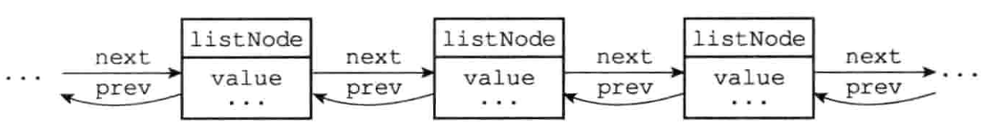
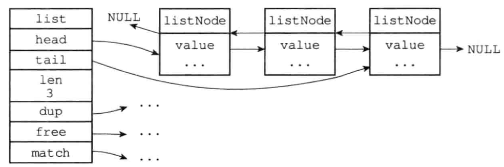

# 链表

> Redis构建了自己的链表实现，作为列表键、发布与订阅、慢查询、监视器等功能的实现基础。Redis服务器本身还使用链表来保存多个客户端的状态信息，以及使用链表来构建客户端输出缓冲区。

# 链表和链表节点的实现

在Redis源码的`adlist.h`声明了链表的节点结构：

```c
typedef struct listNode {
  	// 前驱节点
    struct listNode *prev;
  	// 后继节点
    struct listNode *next;
  	// 节点的值
    void *value;
} listNode;
```

多个`listNode`节点通过`prev`和`next`指针组成双端链表



除此之外，`adlist.h`还提供了操作链表更简单的结构：

```c
typedef struct list {
  	// 头节点
    listNode *head;
  	// 尾节点
    listNode *tail;
  	// 节点值复制函数
    void *(*dup)(void *ptr);
  	// 节点值释放函数
    void (*free)(void *ptr);
  	// 节点值匹配函数
    int (*match)(void *ptr, void *key);
  	// 节点数量
    unsigned long len;
} list;
```

`list`结构为链表提供了表头指针`head`、表尾指针`tail`，以及链表长度计数器`len`，而`dup`、`free`和`match`成员是用于实现多态链表所需的类型特定函数：

- `dup`函数：用于复制链表节点所保存的值
- `free`函数：用于释放链表节点所保存的值
- `match`函数：用于对比链表节点所保存的值和另一个输入值是否相等




| Redis的链表实现      | 特性                                                         |
| -------------------- | ------------------------------------------------------------ |
| 双端                 | 链表节点带有`prev`和`next`指针，获取某个节点的前驱节点和后继节点的时间复杂度都是O(1) |
| 无环                 | 表头节点的`prev`指针和表尾节点的`next`指针都指向NULL，对链表的以NULL为终点 |
| 带表头指针和表尾指针 | 通过`list`结构的`head`指针和`tail`指针，程序获取链表的表头节点的表尾节点的时间复杂度为O(1) |
| 带链表长度计数器     | 程序使用`list`结构的`len`属性来对`list`持有的链表节点进行计数，程序获取链表中节点数量的时间复杂度为O(1) |
| 多态                 | 链表节点使用`void*`指针来保存节点值，并且可以通过`list`结的`dup`、`free`、`match`三个属性为节点值设置类型特定函数，所以链表可以用于保存不同类型的值 |
