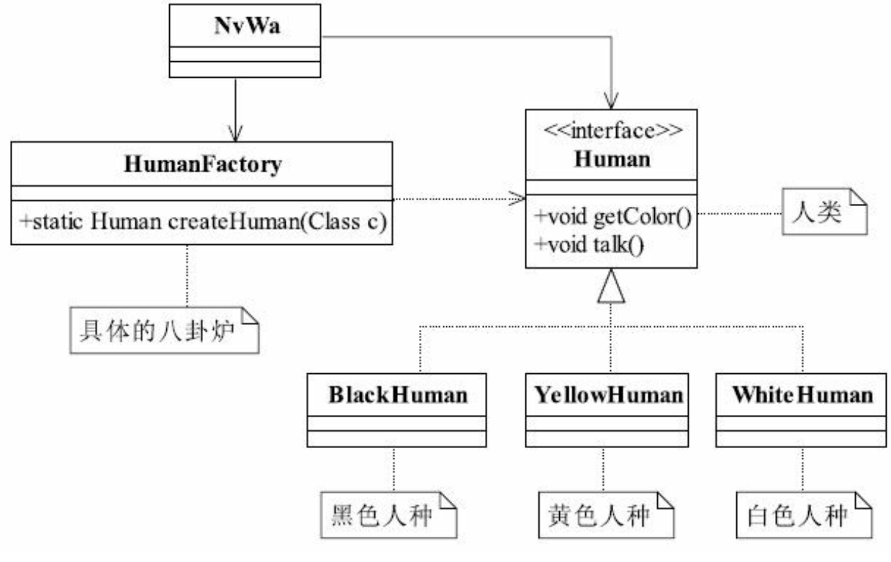
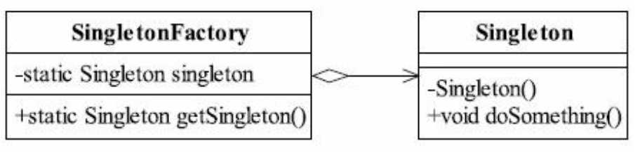

# 工厂方法模式

# 定义

Define an interface for creating an object, but let subclasses decide which class to instantiate. Factory Method lets a class defer instantiation to subclasses. （定义一个用于创建对象的接口，让子类决定实例化哪一个类。工厂方法使一个类的实例化延迟到其子类。）

「工厂方法模式通用类图」

在工厂方法模式中，抽象产品类Product负责定义产品的共性，实现对事物最抽象的定义；Creator为抽象创建类，也就是抽象工厂，具体如何创建产品类是由具体的实现工厂ConcretCreator完成的。

# 应用

## 优点

1. 具有良好的封装性，代码结构清晰
2. 具有良好的扩展性
3. 屏蔽产品类
4. 典型的解耦框架

## 使用场景

1. 工厂方法模式是`new`一个对象的替代品，所有需要生成对象的地方都可以使用，但是需要慎重的考虑是否要增加一个工厂类进行管理，增加代码的复杂度
2. 需要灵活的、可扩展的框架时
3. 使用于异构项目中
4. 使用于测试驱动开发的框架下

# 扩展

## 缩小为简单工厂模式

「女娲造人类图（工厂方法模式）」

==> 

「女娲造人类图（简单工厂模式）」

简单工厂模式(Simple Factory Pattern)，也叫静态工厂模式，其缺点是工厂类的扩展比较困难

## 升级为多个工厂类

场景：初始化一个对象非常耗费精力，所有的产品类都放到一个工厂方法中进行初始化会使代码结构不清晰

解决：为每一个产品定义一个创造者，然后由调用者自己去选择与哪一个工厂方法关联

「女娲造人类图（多个工厂类）」

## 替代单例模式

「工厂方法模式替代单例模式类图」

## 延迟初始化

延迟初始化(Lazy initialization)：一个对象被消费完毕后，并不立刻释放，工厂保持其初始状态，等待再次被使用

