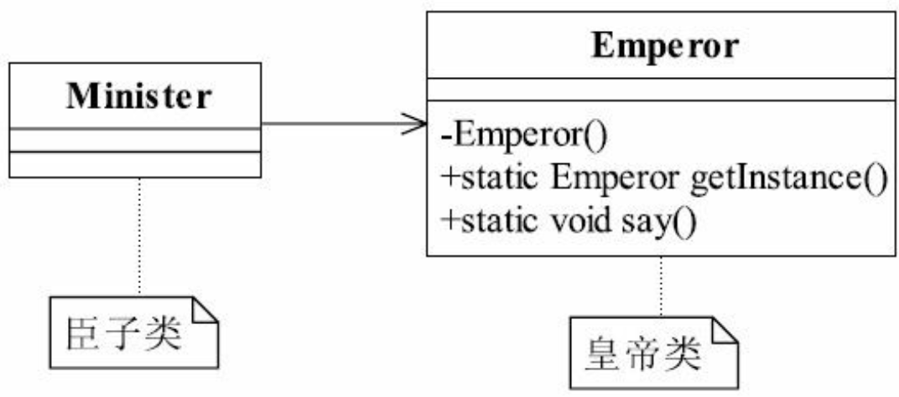
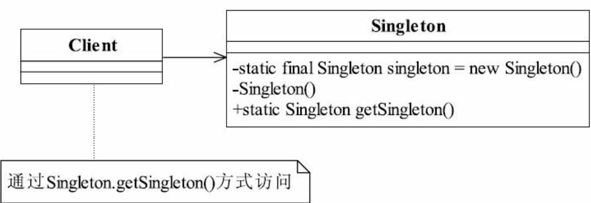

# 单例模式

【栗子🌰】「臣子叩拜皇帝类图」



一个类只能产生一个对象 => 构造器私有，禁止外部创建对象

`Emperor.java`

```java
public class Emperor {
  private static final Emperor INSTANCE = new Emperor();
  private Emperor() {
  }
  public static Emperor getInstance() {
    return INSTANCE;
  }
  public void say() {
    System.out.println("朕的江山社稷啊~~~");
  }
}
```

`Minister.java`

```java
public class Minister {
  public static void main(String[] args) {
    for(int day = 1; day <= 3; day++) {
      Emperor emperor = Emperor.getInstance();
      emperor.say();
    }
  }
}
```

Output:

```
朕的江山社稷啊~~~
朕的江山社稷啊~~~
朕的江山社稷啊~~~
```


# 一、单例模式的定义

单例模式（Singleton Pattern）Ensure a class has only one instance, and provide a global point of access to it. 确保某一个类只有一个实例，而且自行实例化冰箱整个系统提供这个实例

「单例模式通用类图」



通用代码：

```java
public class Singleton {
  private static final Singleton INSTANCE = new Singleton();
  // 限制产生多个对象
  private Singleton(){}
  // 通过该方法获取实例对象
  public static Singleton getInstance() {
    return INSTANCE;
  }
  // 类中的其他方法，尽量是static
  public static void doSomething() {
  }
}
```


# 二、单例模式的应用

## 2.1 单例模式的优点

1. 减少内存开支
2. 减少系统性能开销
3. 避免对资源的多重占用
4. 优化和共享资源访问

## 2.2 单例模式的缺点

1. 扩展困难
2. 不利于测试
3. 与单一职责原则冲突

## 2.3 单例模式的使用场景

1. 要求生成唯一序列号的环境
2. 在整个项目中需要一个共享访问点或者共享数据
3. 创建一个对象需要消耗的资源过多
4. 需要定义大量的静态常量和静态方法（如工具类）的环境

## 2.4 单例模式的注意事项

1. 线程不安全问题

	```java
	public class Singleton {
	  private static Singleton singleton; //限制产生多个对象
	  private Singleton(){}
	  //通过该方法获得实例对象
	  public static Singleton getSingleton(){
	    if(singleton == null){
	      singleton = new Singleton();
	    }
	    return singleton;
	  }
	}
	```

	上述代码在并发量增加时可能出现多个实例。

	解决方案：

	- 饿汉式：事先初始化好对象

		```java
		public class Singleton {
		  private static final Singleton singleton = new Singleton(); //限制产生多个对象
		  private Singleton(){
		  }
		  //通过该方法获得实例对象
		  public static Singleton getSingleton(){
		    return singleton;
		  }
		  //类中其他方法，尽量是static
		  public static void doSomething(){}
		}
		```

		

	- 懒汉式：懒加载方式

		```java
		public class Singleton {
		  private static Singleton singleton; //限制产生多个对象
		  private Singleton(){}
		  //通过该方法获得实例对象
		  public static Singleton getSingleton(){
		    synchronized(this) {
		      if(singleton == null){
		        singleton = new Singleton();
		      }
		    }
		    return singleton;
		  }
		}
		```

2. 考虑对象复制的情况

	=> 单例不要实现`Cloneable`接口
