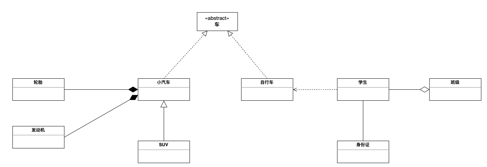
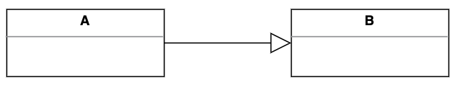
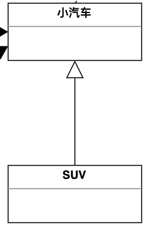
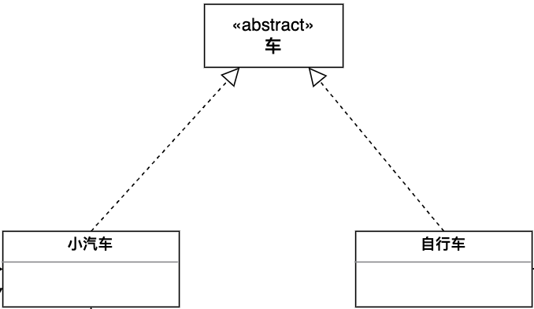
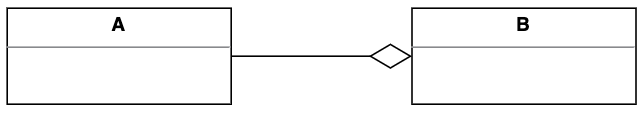
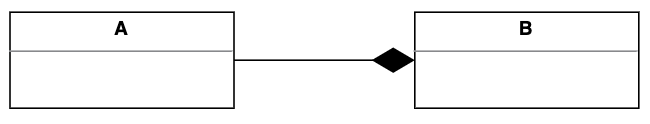
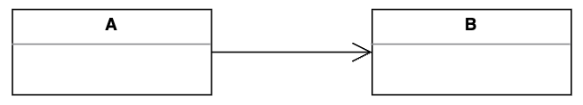
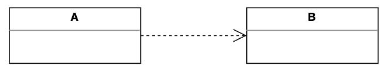

# 看懂UML图

# 示例

上述UML图描述了以下关系：

- 车的类图结构为`<<abstract>>`，表示车是一个抽象类
- 车有两个继承类：小汽车和自行车；它们之间的关系为实现关系，使用带空心箭头的虚线表示
- 小汽车与SUV之间是继承关系；它们之间的关系为泛化关系，使用带空心箭头的实线表示
- 小汽车与发动机、轮胎之间是组合关系，使用带实心箭头的实线表示
- 学生与班级之间是聚合关系，使用带空心箭头的实线表示
- 学生与身份证之间为关联关系，使用一根实现表示
- 学生上学需要使用到自行车，与自行车是一种依赖关系，使用带箭头的虚线表示

# 类之间的关系

## 泛化关系（generalization）

类的继承结构表现在UML中为：泛化与实现

继承关系为`is-a`的关系，表示`...是...`，栗子🌰：猫是动物

泛化关系用一条带空心箭头的实线表示

上图表示一种泛化关系，A继承自B

栗子🌰：汽车在现实中有实现，可以用汽车定义具体的对象；汽车与SUV之间为泛化关系：

📢注意：在代码中，泛化关系表现为继承非抽象类

## 实现关系（realize）

实现关系用一条带空心箭头的虚线表示

栗子🌰：”车“是一个抽象概念，在现实中并无法直接用来定义对象，只有指明具体的子类（汽车还是自行车）时才可以用来定义对象

📢注意：在代码中，实现关系表现为继承抽象类或者实现接口

## 聚合关系（aggregation）

聚合关系用一条带空心菱形箭头的直线表示

栗子🌰：如下图表示A聚合到B上，或者说是B由A聚合而成

聚合关系用于表示实体对象之间的关系，表示整体由部分构成的语义；例如一个部门由多个员工组成；

与组合关系的区别：整体和部分不是强依赖的，即使整体不存在了，部分依然存在；例如，部门撤销了，人员不会消失，他们依然存在

## 组合关系（composition）

组合关系用一条带实心菱形箭头的之间表示

栗子🌰：如下图表示A组成B，或者说是B由A组成

与聚合关系一样，组合关系同样表示整体由部分构成的语义；比如公司由多个部门组成

但是组合关系是一种强依赖的特殊聚合关系，如果整体不存在了，则部分也不存在了；例如公司不存在了，部门也将不存在了

## 关联关系（association）

关联关系用一条直线表示

它描述不同类的对象之间的结构关系；它是一种静态关系，通常与运行状态无关，一般由常识等因素决定；它一般用来定义对象之间静态的、天然的结构；因此，关联关系是一种“强关联”的关系

栗子🌰：乘车人和车票之间就是一种关联关系，学生和学校就是一种关联关系

关联关系默认不强调方向，表示对象之间相互知道；如何特别强调方向，如下图，表示A知道B，但是B不知道A

📢注意：在代码中，关联关系通常是以成员变量的形式实现的

## 依赖关系（dependency）

依赖关系是用一套带箭头的虚线表示的

栗子🌰：下图表示A依赖于B，它描述一个对象在运行期间会用到另一个对象的关系

与关联关系不同的是，依赖关系是一种临时性关系，通常在运行期间产生，并且随着运行时的变化，依赖关系也可能发生变化

依赖有方向，双向依赖是一种糟糕的结构，作为开发者，我们应该保持单向依赖，杜绝双向依赖的产生

📢注意：在代码中，依赖关系体现为类构造方法以及类方法的传入参数，箭头的指向为调用关系，依赖关系除了临时知道对方之外，还使用了对方的方法和属性