# 字典


字典，即符号表 (symbol table)、关联数组 (accociative array)、映射 (map)，是一种保存KV键值对的抽象数据结构。字典中每个键都是独一无二的，程序可以在字典中根据键来查找与之关联的值，或者通过键来更新值，又或者根据键来删除整个键值对等操作。

Redis构建了自己的字典实现，字典在Redis中的应用非常广泛，例如Redis的数据库、哈希键等。

# 一、字典的实现

Redis的字典使用哈希表作为底层实现，一个哈希表里面可以有多个哈希表节点，每个哈希表节点就保存了字典的一个键值对。

## 1.1 哈希表

`<dict.h>/dictht`

```c
typedef struct dictht {
  // 哈希表数组
  dictEntry **table;
  // 哈希表大小
  unsigned long size;
  // 哈希表大小掩码，用于计算索引值，总是等于size - 1
  unsigned long sizemask;
  // 该哈希表已有节点的数量
  unsigned long used;
} dictht;
```

`table`属性是一个数组，数组中的每个元素都是一个指向`<dict.h>/dictEntry`结构的指针，每一个`dictEntry`结构都保存着一个键值对。

【栗子🌰】一个大小为4的空哈希表

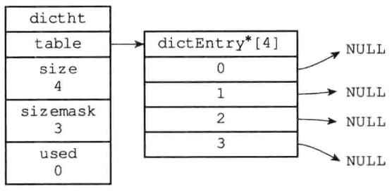

## 1.2 哈希表节点

哈希表节点使用`dictEntry`结构表示，每个`dictEntry`结构都保存了一个键值对：

```c
typedef struct dictEntry {
  // key
  void *key;
  // value
  union {
    void *val;
    uint64_t u64;
    int64_t s64;
    double d;
  } v;
  // 指向下一个哈希表节点，形成链表
  struct dictEntry *next;
} dictEntry;
```

`key`属性保存键值对中的键，`v`属性保存键值对中的值，其中值可以保存一个指针或者一个`uint64_t`整数，或者是一个`int64_t`整数，又或者是一个`double`浮点数。`next`属性是指向另一个哈希表节点的指针，这个指针可以将多个哈希值相同的键值对连接在一起，用来解决哈希冲突（collision）的问题

【栗子🌰】通过`next`指针，将两个索引值相同的键k1和k0连接在一起

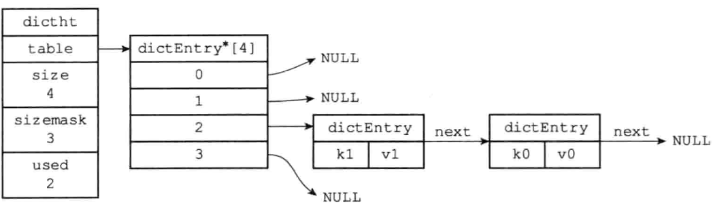


## 1.3 字典

`<dict.h>/dict`

```c
typedef struct dict {
	// 类型特定函数
  dictType *type;
  // 私有数据
  void *privdata;
  // 哈希表
  dictht ht[2];
  // rehash索引，当rehash不在进行的时候，值为-1
  long rehashidx; /* rehashing not in progress if rehashidx == -1 */
  // 当前正在执行到迭代器数量
  int iterators; /* number of iterators currently running */
} dict;
```

`type`属性和`privdata`属性是针对不同类型的键值对，为创建多态字典而设置的。

- `type`属性是一个指向`dictType`结构的指针，每个`dictType`结构保存了一簇用于操作特定类型键值对的函数，Redis会为用途不同的字典设置不同类型特定函数

  ```c
  typedef struct dictType {
    // 计算哈希值的函数
    unsigned int (*hashFunction)(const void *key);
    // 复制键的函数
    void *(*keyDup)(void *privdata, const void *key);
    // 复制值的函数
    void *(*valDup)(void *privdata, const void *obj);
    // 对比键的函数
    int (*keyCompare)(void *privdata, const void *key1, const void *key2);
    // 销毁键的函数
    void (*keyDestructor)(void *privdata, void *key);
    // 销毁值的函数
    void (*valDestructor)(void *privdata, void *obj);
  } dictType;
  ```

- `privdata`属性保存了需要传递给那些类型特定函数的可选参数

`ht`属性是一个包含两个项的数组，数组中的每个项都是一个`dictht`哈希表，一般情况下，字典只使用`ht[0]`哈希表，`ht[1]`哈希表只会在对`ht[0]`哈希表进行 rehash 操作时使用。

【栗子🌰】普通状态下（没有进行`rehash`）的字典

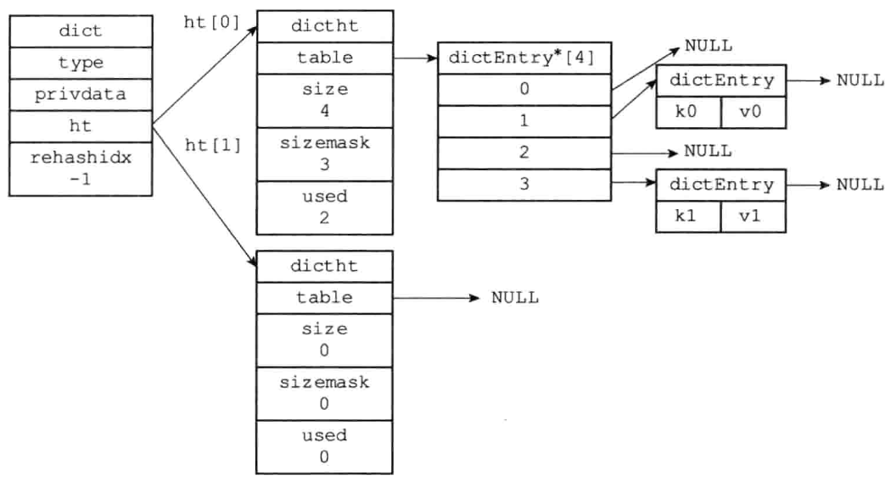


# 二、哈希算法

当要将一个新的键值对添加到字典里面时，程序需要先根据键值对的键计算出哈希表和索引值，然后在根据索引值，将包含新键值对的哈希表节点放到哈希表数组的指定索引上。

Redis计算哈希值：

```c
# 使用字典设置的哈希函数，计算键key的哈希值
#define dictHashKey(d, key) (d)->type->hashFunction(key)
unsigned int hash = dict->type->hashFunction(key);
```

Redis计算索引值：

```c
static int _dictKeyIndex(dict *d, const void *key)
{
  unsigned int h, idx, table;
  // ...
  /* Compute the key hash value */
  h = dictHashKey(d, key);
  for (table = 0; table <= 1; table++) {
    // 使用哈希表的sizemask属性和哈希值，计算出索引值
    // 根据情况不同，ht[table]可以是ht[0]或者是ht[1]
    idx = h & d->ht[table].sizemask;
    // ....
  }
  return idx;
}
```

【栗子🌰】

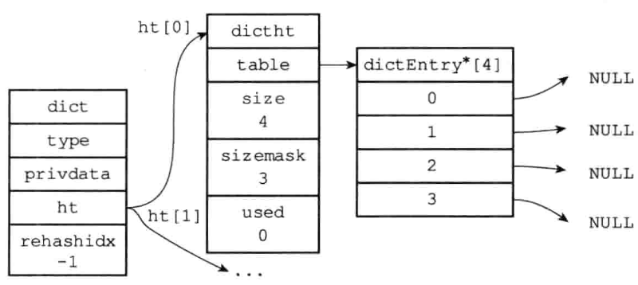

对于上图的字典来说，现在要将一个键值对(k0, v0)添加到字典里面

```c
unsigned int hash = dict->type->hashFunction(k0);
```

计算键k0的哈希值。假设计算出来的哈希值`hash = 8`

```c
unsigned int idx = hash & dict->ht[0].sizemask; // 8 & 3 = 0
```

计算出键k0的索引值为0，这表示包含键值对(k0, v0)的节点应该被放置到哈希表数组的索引0位置上

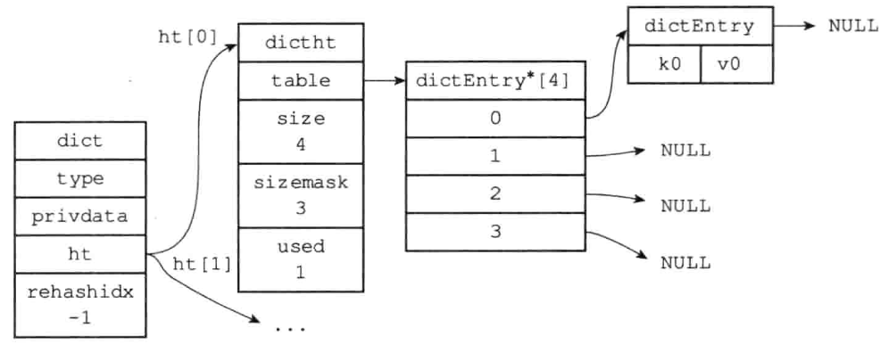

📢注意：在创建字典时，可以通过指定哈希函数来自定义哈希算法。默认情况下，Redis采用MurmurHash2算法作为哈希函数。

Redis采用MurmurHash2算法作为哈希函数有以下几个理由：

1. 均匀性好：MurmurHash2是一种高质量、快速的哈希算法，它能够将任意长度的输入数据映射到一个固定长度的哈希值上。经过统计和实验验证，它的哈希结果分布均匀，哈希冲突率低，这对于Redis来说非常重要，因为哈希表是Redis中最核心的数据结构之一。
2. 计算速度快：MurmurHash2算法使用位运算、乘法和异或等简单的数学运算，计算速度非常快。这对于Redis来说也非常重要，因为Redis需要快速地处理大量的键值对数据。
3. 误差率低：MurmurHash2算法具有良好的随机分布性，而且其哈希结果的误差率极低，即使对于非常短的字符串，它的哈希结果也很难产生冲突。这保证了Redis在处理各种类型的数据时都能获得良好的哈希性能。


# 三、解决键冲突

当有两个或以上数量的键被分配到了哈希表数组的同一个索引上时，键发生了冲突。

Redis的哈希表使用了**链地址法**来解决键冲突，每个哈希表节点都有一个next指针，多个哈希表节点可以用next指针构成一个单向链表，被分配到同一个索引上的多个节点可以用这个单向链表连接起来，由此解决了键冲突的问题。

【栗子🌰】

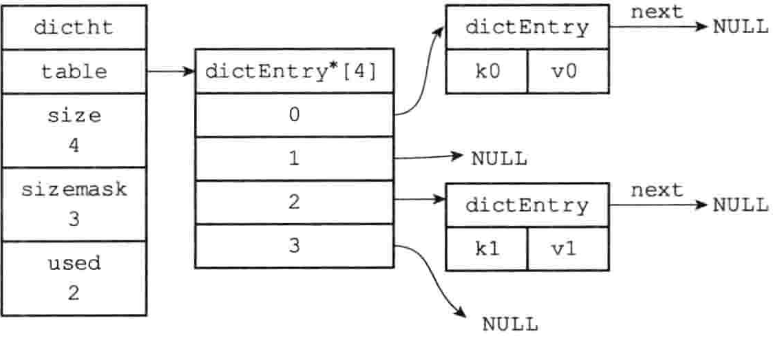

假设程序要将键值对(k2, v2)添加到上图所示的哈希表里面，并且计算得k2的索引值为2，那么键k1和k2將产生冲突，而解决冲突的办法就是使用next指针将键k2和k1所在的节点连接起来。

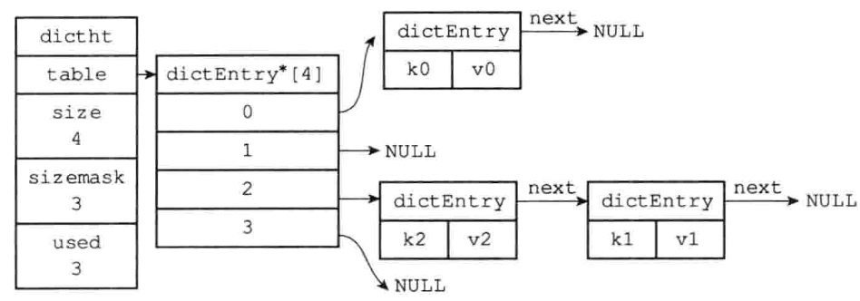

> 因为`dictEntry`节点组成的链表没有指向链表表尾的指针，所以为了速度考虑，Redis使用头插法插入新节点，即新节点总是被添加链表的表头位置，时间复杂度为O(1)


# 四、rehash

随着操作的不断执行，哈希表中保存的键值对会逐渐地增多或者减少，为了让哈希表的负载因子 Load Factor 维持在一个合适的范围之内，当哈希表保存的键值对数量过多或者过少的时候，程序要需要对哈希表的大小进行相应的扩展或者收缩。

> Redis哈希表的负载因子指哈希表中已用节点数与哈希表大小之比，即：
>
> ```c
> double load_factor = used / size
> ```
>
> 其中，`used`表示哈希表中已经使用的节点数，`size`表示哈希表的大小（即槽位数量）。
>
> 在Redis中，默认的哈希表大小是4个槽位/桶位，当负载因子超过0.5时，Redis会自动将哈希表的大小扩大一倍。这是因为当哈希表中的节点数量接近哈希表大小时，哈希冲突的概率会变高，引起查找性能的下降，所以需要扩大哈希表的大小以保证哈希表的查找性能。
>
> 同时，在哈希表缩小的过程中，如果哈希表的负载因子小于等于0.1，Redis会自动将哈希表的大小缩小到当前已使用节点数的两倍。这样可以避免浪费内存空间，提高Redis的运行效率。

扩展和收缩哈希表的工作可以通过执行rehash（重新散列）操作来完成，Redis的rehash步骤：

1. 为字典的ht[1]哈希表分配空间，这个哈希表的空间大小取决于要执行的操作，以及`ht[0].used`属性的值
   1. 扩展操作：`ht[1].size` = 第一个大于等于`ht[0].used * 2` 的 2^n^
   2. 收缩操作：`ht[1].size` = 第一个大于等于`ht[0].used`的2^n^
2. 将保存在ht[0]中的所有键值对rehash到ht[1]上：rehash是重新计算键的哈希值和索引值，然后将键值对放置到ht[1]哈希表的指定位置上
3. 当ht[0]包含的所有键值对都迁移到了ht[1]之后，即此时ht[0]变为空表，释放ht[0]，将ht[1]设置给ht[0]，并在ht[1]新创建一个空白的哈希表，为下一个rehash做准备

【栗子🌰】

假设程序要对下图所示字典的ht [0]进行扩展操作，那么程序将执行以下步骤:

「执行rehash之前的字典」

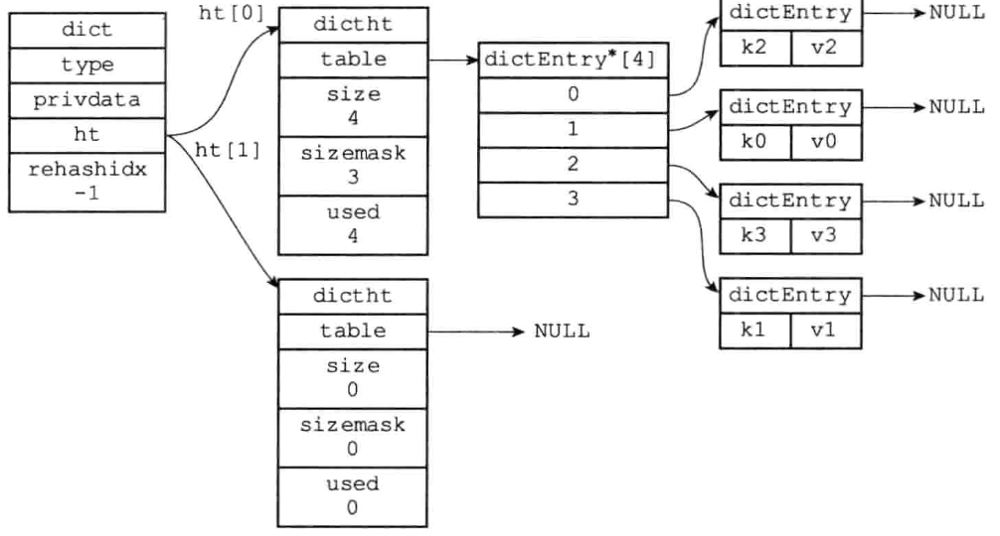

1. `ht[0].used = 4`，`4 * 2 = 8`，而8(2^3^)正是第一个大于等于8的2的幂次方，所以`ht[1].size = 8`

   「为字典的ht[1]哈希表分配空间」

   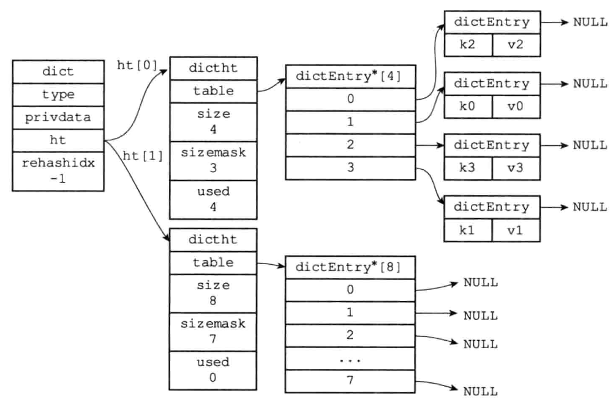

2. 将ht[0]包含的四个键值对都rehash到ht[1]

   「ht[0]的所有键值对迁移到ht[1]」

   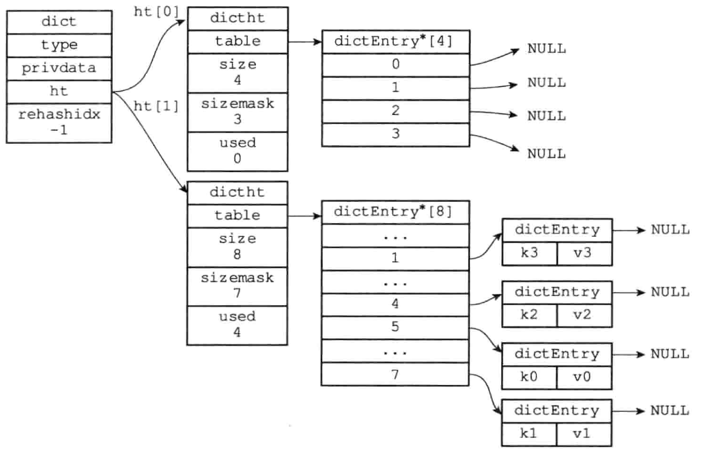

3. 释放ht[0]，并`ht[0] = ht[1]`，然后为ht[1]分配一个空白哈希表

   「完成rehash之后的字典」

   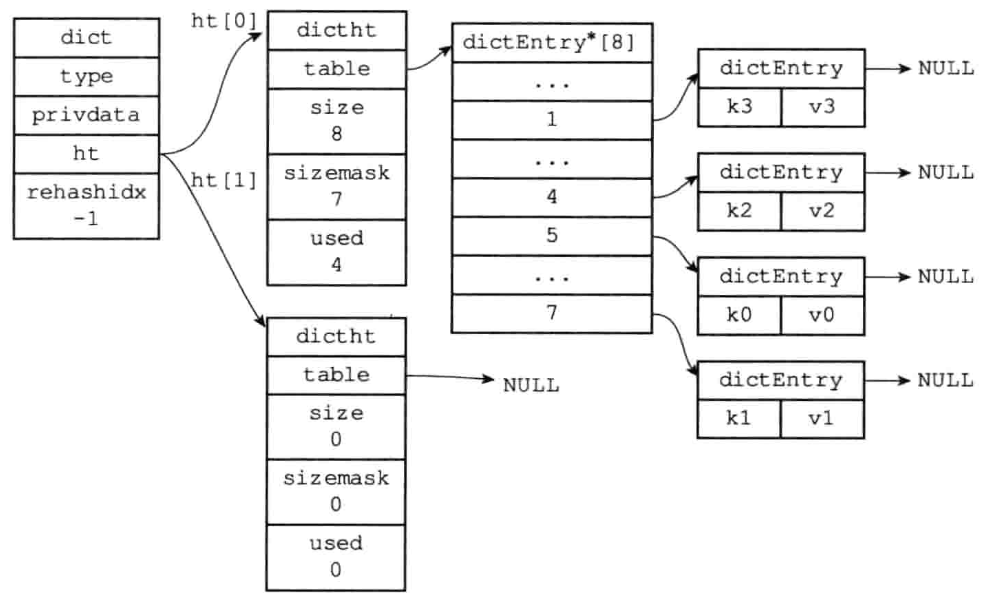


# 五、渐进式rehash

Redis在进行哈希表扩展或者收缩时，不会一次性地将整个哈希表中的所有元素都从旧哈希表迁移到新哈希表中，而是通过分多次完成这一过程，逐步将旧哈希表中的节点转移到新哈希表中。这种方式可以避免在单次哈希表扩展操作中直接将所有节点迁移到新哈希表中导致Redis服务器出现阻塞现象。

哈希表渐进式rehash的详细步骤：

1. 为ht[1]分配空间
2. 在字典中维护一个索引计数器变量`rehashidx`，并将它的值设置为0，表示rehash操作开始
3. 在rehash进行期间，每次对字典执行层删改查操作时，程序除了执行指定操作外，还会顺带将ht[0]哈希表在rehashidx索引上的所有键值对rehash到ht[1]，随后`rehashidx++`
4. 随着字典操作的不断执行，最终ht[0]的所有键值对都是被rehash到ht[1]上，此时将`rehashidx`设置为-1，表示rehash操作已经完成


## 渐进式rehash执行期间的哈希表操作

在Redis的渐进式哈希表扩展操作中，哈希表操作会被分成两个部分：对旧哈希表(ht[0])的读/写操作和对新哈希表(ht[1])的读/写操作。在扩展期间，所有写入操作会优先向新哈希表中执行，而读取操作则需要同时访问旧哈希表和新哈希表。

具体来说，当执行扩展期间的哈希表读/写操作时，Redis会采用以下策略：

1. 在进行读操作时，如果在ht[1]中找到了相应的键值对，则直接返回该键值对；否则，在ht[0]中查找相应的键值对。
2. 在进行写操作时，如果当前哈希表已经开始扩展，则将键值对写入ht[1]中；否则，在旧哈希表中写入键值对。

📢注意：在对哈希表进行迁移操作时，可能存在哈希表缩容（收缩）的情况。此时，Redis会使用类似的方法对旧哈希表进行读/写操作，并且所有写操作都会优先向旧哈希表中执行，而读取操作则需要同时访问旧哈希表和新哈希表。最后，当所有元素都成功迁移到新哈希表之后，Redis会销毁旧哈希表并释放相关内存空间。