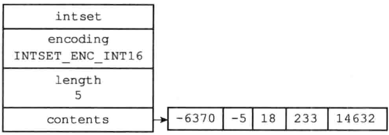
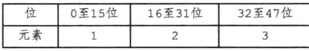
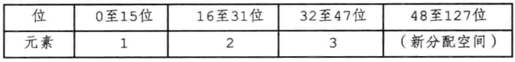
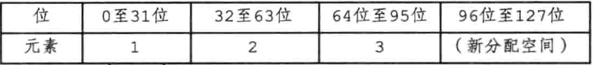
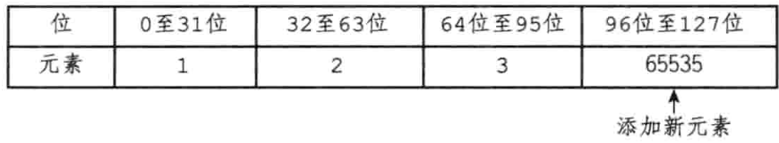

# 整数集合

整数集合（intset）是集合键的底层实现之一，当一个集合只包含整数值元素，并且这个集合元素不多时，Redis就会使用整数集合来作为集合键的底层实现。


# 一、整数集合的实现

intset 是Redis用于保存整数值的集合抽象数据结构，它可以保存类型为`int16_t`、`int32_t`或者`int64_t`的整数值，并且保证集合中不会出现重复元素。

`<intset.h>/intset`

```c
typedef struct intset {
  // 编码方式
  uint32_t encoding;
  // 集合包含的元素数量
  uint32_t length;
  // 保存元素的数组
  int8_t contents[];
} intset;
```

`contents`数组是整数集合的底层实现：整数集合的每个元素都是contents数组的一个元素，各个元素在数组中按照值的大小从小到大有序排列，并且数组中不包含任何的重复项。

📢注意：虽然intset结构将contents属性声明为int8_t类型的数组，但实际上contents数组并不保存任何int8_t类型的值，contents数组的真正类型取决于encoding属性的值

`encoding`属性的取值：

```c
/* Note that these encodings are ordered, so:
 * INTSET_ENC_INT16 < INTSET_ENC_INT32 < INTSET_ENC_INT64. */
#define INTSET_ENC_INT16 (sizeof(int16_t))
#define INTSET_ENC_INT32 (sizeof(int32_t))
#define INTSET_ENC_INT64 (sizeof(int64_t))
```

【栗子🌰】：`INTSET_ENC_INT32` => contents就是一个类型为int32_t的数组

「一个包含五个int16_t类型整数值的整数集合」



contents数组的大小为`sizeof(int16_t) * 5`，即80位


# 二、升级

✅发生条件：每当要将一个新元素添加到整数集合里面，并且新元素的类型比整数集合现有所有元素的类型都要长时，整数集合需要先进行升级，然后才能将新元素添加到整数集合里面。

升级整数集合并添加新元素的步骤：

1. 根据新元素的类型，扩展整数集合底层数组的空间大小，并为新元素分配空间
2. 将底层数组现有的所有元素都转换成与新元素相同的类型，并将类型转换后的元素放置到正确的位上，而且在放置元素的过程中，需要继续维持底层数组的有序性质不变
3. 将新元素添加到底层数组中

【栗子🌰】

「一个包含三个int16_t类型的元素的整数集合」


「contents数组的各个元素及他们所在的位」



添加类型为int32_t的整数值65535，『升级』

首先进行空间重新分配

「进行空间重分配后的数组」



「移动原有元素位置到int32_t类型的位置上，倒序」



「添加新元素」



「修改encoding和length，完成添加操作」


> ### 升级之后新元素的摆放位置
>
> 引发升级的新元素的长度总是比整数集合现有所有元素的长度都大，因此这个新元素的值要么就大于所有现有元素，要么就小于所有现有元素
>
> - 小于所有现有元素 => 索引0
> - 大于所有现有元素 => 索引 length - 1


# 三、升级的好处

## 3.1 提高灵活性

C 语言是静态类型语言，为了避免类型错误，我们通常不会将两种不同类型的值放在同一个数据结构里面。

但是，因为整数集合可以通过自动升级底层数组来适应新元素，所以我们可以随意地将int16_t、int32_t或者int64_t 类型的整数添加到集合中，而不必担心出现类型错误，这种做法非常灵活。

## 3.2 节约内存

 要让一个数组可以同时保存int16_t、int32_t、int64_t三种类型的值，最简单的做法就是直接使用int64_t类型的数组作为整数集合的底层实现。

但是，这样处理，即使添加到整数集合里面的都是int16_t类型或者int32_t类型的值，数组都需要使用int64_t 类型的空间去保存它们，出现浪费内存的情况。而整数集合现在的做法既可以让集合能同时保存三种不同类型的值，又可以确保升级操作只会在有需要的时候进行，这可以尽量节省内存。


# 四、降级

Redis的整数集合不支持降级操作，一旦 intset 内部编码发生升级，就无法再回到较低版本的编码方式。这是因为升级操作可能会涉及到元素顺序、元素位置等方面的变化，而这些变化在降级时难以保证数据的正确性和一致性。因此，在内部编码升级后，Redis会继续使用新的编码方式来处理 intset中的所有元素，直到升级成为必要时才会进行升级。