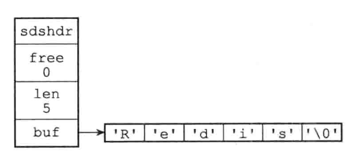
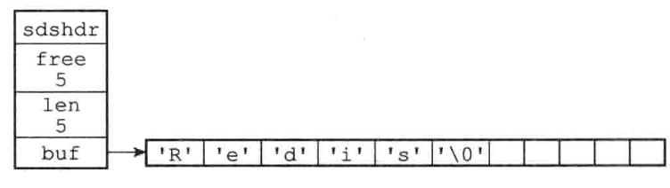

Redis构建了一种名为简单动态字符串（simple dynamic string, SDS）的抽象类型，并将SDS用作Redis的默认字符串表示。

## 一、SDS的定义

```c
struct sdshdr {
  
  // 记录buf数组中已使用字节的数量
  // 等于SDS所保存字符串的长度
  int len;
  
  // 记录buf数组中未使用字节的数量
  int free;
  
  // 字节数组，用于保存字符串
  char buf[];
}
```

【栗子🌰】



上图展示了一个SDS示例：

- `free=0`，表示这个SDS没有分配任何未使用空间
- `len=5`，表示这个SDS保存了一个五字节长的字符串
- `buf`属性一个char类型的数组，数组的前五个字节分别保存了'R'、'e'、'd'、'i'、's'，最后一个字节保存了空字符'\0'

SDS遵循C字符串以空字符结尾的惯例，保存空字符的1字节空间不计算在SDS的len属性里面，并且为空字符串分配额外的1字节空间，以及添加空字符到字符串末尾等操作都是SDS函数自动完成的，所以说这个空字符对于SDS的使用者来说是完全透明的。遵循这一惯例的好处是SDS可以直接重用一部分C字符串函数库内部的函数。

【栗子🌰】



与上一个SDS案例不同的是，本例中的SDS为`buf`数组分配了五字节未使用的空间，因此`free=5`


# 二、SDS与C字符串的区别

> C语言使用的简单字符串的表示方式不能满足Redis对字符串在安全性、效率以及功能方面的要求。

## 2.1 常数复杂度获取字符串的长度

C字符串本身并不记录自身的长度信息，因此获取一个C字符串长度必须遍历整个字符串，直至遇到字符串结尾的空字符，这个操作的时间复杂度是O(N)。

SDS本身在`len`属性中记录了SDS本身的长度，因此获取一个SDS的长度所需的时间复杂度仅为O(1)。同时，设置和更新SDS长度的工作是由SDS的API在执行时自动完成的，无需进行任何手动修改长度的操作。

=> 通过上述操作，Redis将获取字符串长度所需要的复杂度降到了O(1)，这确保了获取字符串长度的工作不会成为Redis的性能瓶颈。


## 2.2 杜绝缓冲区溢出

C语言字符串不记录自身长度带来的问题：

- 获取字符串长度复杂度高
- 容易造成缓冲区溢出（buffer overflow）

> 【栗子🌰】：缓冲区溢出
>
> <string.h>库中有一个`strcat`函数可以将src字符串中的内容拼接到dst字符串的末尾：`char *strcat(char *dst, const char *src);`
>
> 因为C字符串不记录自身的长度，所以`strcat`假定用户在执行这个函数时 ，已经为dst 分配了足够多的内存，可以容纳src 字符串中的所有内容，而一旦这个假定不成立时，就会产生缓冲区溢出。

与C字符串不同的是，SDS的**空间分配策略**完全杜绝了发生缓冲区溢出的可能性。

当SDS API需要对SDS进行修改时，API会先检查SDS的空间是否满足修改所需的条件，如果不满足，API会自动降SDS的空间扩展至执行修改所需要的空间大小，然后才执行实际的修改操作。因此使用SDS不会出现缓冲区溢出的问题。


## 2.3 减少修改字符串时带来的内存重分配次数

C字符串的长度和底层数组的长度之间存在着关联性，每次增长或者缩短一个C字符串，程序总要对保存这个C字符串的数组进行一次内存重分配的操作：

- 增长字符串的操作，如拼接（append），在执行这个操作之前，程序需要先通过内存重分配来扩展底层数组的空间大小，如果忘记这一步就会产生缓冲区溢出。
- 缩短字符串的操作，如截断（trim），在执行这个操作之后，程序需要通过内存重分配来释放字符串不再使用的那部分空间，如果忘记这一步就会产生内存泄漏。

因为内存重分配需要涉及复杂的算法，并且可能执行系统调用，因此它通常是一个比较耗时的操作。Redis作为数据库，经常被用于速度要求高、数据频繁被修改的场景，如果每一次修改字符串的长度都需要执行一次内存重分配的话，那么单是内存重分配的时间就会占用大部分的修改字符串所需要的时间，如果频繁发生这种操作，还会对性能造成影响。

为了避免这种情形，Redis中的SDS实现了**空间预分配**和**惰性空间释放**两种优化策略。

### 2.3.1 空间预分配

空间预分配用于优化SDS字符串的增长操作，当对一个SDS进行修改并且需要对SDS进行空间扩展的时候，程序不仅会对SDS分配需要修改所必需的空间，还会为SDS分配额外的未使用的空间。

额外分配的未使用空间大小有一定的策略：

- 如果对SDS进行修改之后，`SDS的长度（也就是len属性的值） < 1MB`，程序分配和`len`属性同样大小的未使用空间，即此时`len == free`。

  【栗子🌰】

  修改之后，SDS的`len=13bytes`，那么buf数组的实际长度将变成`13+13+1=27 bytes`（额外的一字节用于保存空字符）

- 如果对SDS进行修改之后，`SDS的长度（也就是len属性的值） < 1MB`，程序分配1MB大小的未使用空间。

  【栗子🌰】

  修改之后，SDS的`len=30MB`，那么程序会分配1MB的未使用空间，SDS的buf数组的实际长度将为`30MB + 1MB + 1byte`。

通过空间预分配策略，Redis可以减少连续执行字符串增长操作所需要的内存重分配次数。


### 2.3.2 惰性空间释放

惰性空间释放用于优化SDS字符串的缩短操作：当需要缩短SDS保存的字符串时，程序并不会立即使用内存重分配来回收缩短后多出来的字节，而是使用`free`属性记录这些字节的数量，并等待将来使用。

通过惰性空间释放策略，SDS避免了缩短字符串时所需的内存重分配操作，并为将来可能有的增长操作提供了优化。同时，SDS也提供了真正释放为使用空间的API，因此无须担心惰性空间释放策略会造成内存浪费。


### 2.3.4 二进制安全

C字符串中的字符必须符合某种编码，例如ASCII，并且除了字符串的末尾之外，字符串中不能包含空字符，否则最先被读入的空字符会被认为是一个字符串的结尾。这些限制使得C字符串只能保存文本数据，而不能保存像图片、音频、视频、压缩文件这样的二进制数据。

为了确保Redis可以适用于各种不同的使用场景，SDS的API都是二进制安全的（binary-safe）。

所有的SDS API都会以处理二进制的方式来处理SDS存放在buf数组里的数据，程序不会对其中的数据做任何变动。

=> 因此，我们将SDS的buf属性成为字节数组。


### 2.3.5 总结

|                            | C字符串                                    | SDS                                        |
| -------------------------- | ------------------------------------------ | ------------------------------------------ |
| 获取字符串长度的时间复杂度 | O(N)                                       | O(1)                                       |
| 安全性                     | 不安全，可能会造成缓冲区溢出               | 安全，不会造成缓冲区溢出                   |
| 内存重分配情况             | 修改字符串长度N次**必然**进行N次内存重分配 | 修改字符串长度N次**最多**进行N次内存重分配 |
| 使用场景                   | 智能保存文本数据                           | 可以保存文本数据或者二进制数据             |
| <string.h>库函数使用情况   | 所有函数                                   | 部分函数                                   |


