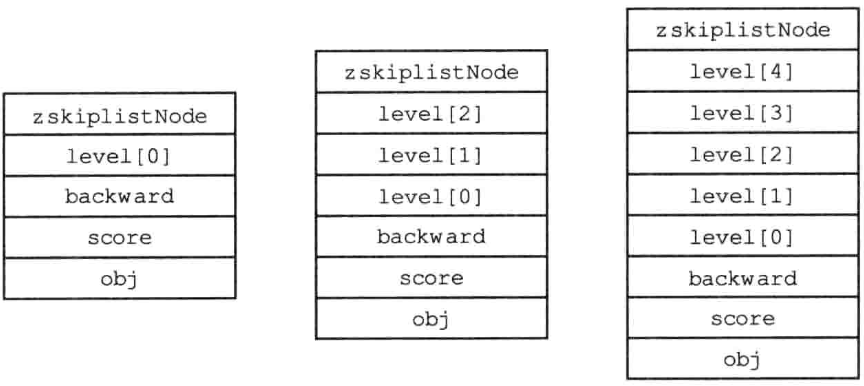
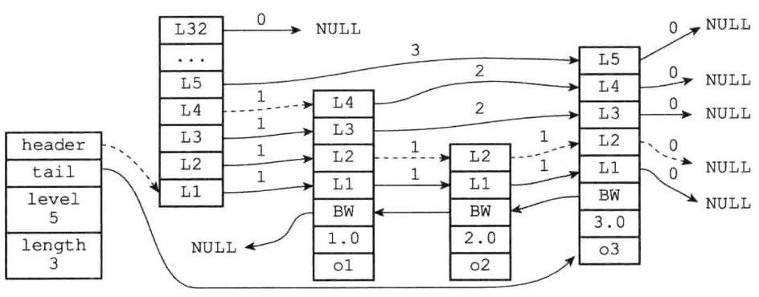
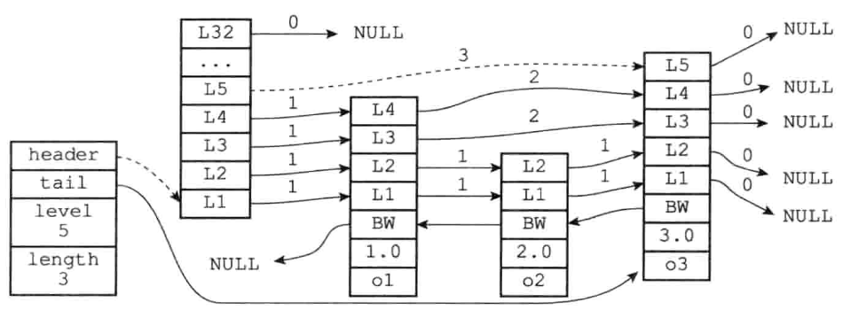
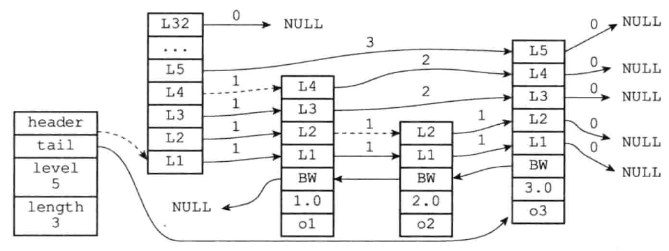
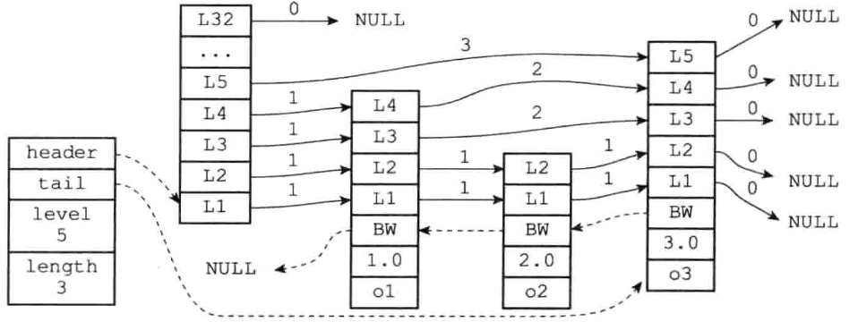
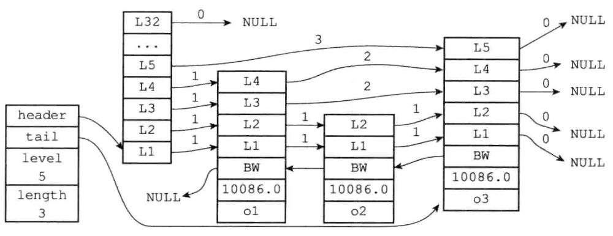
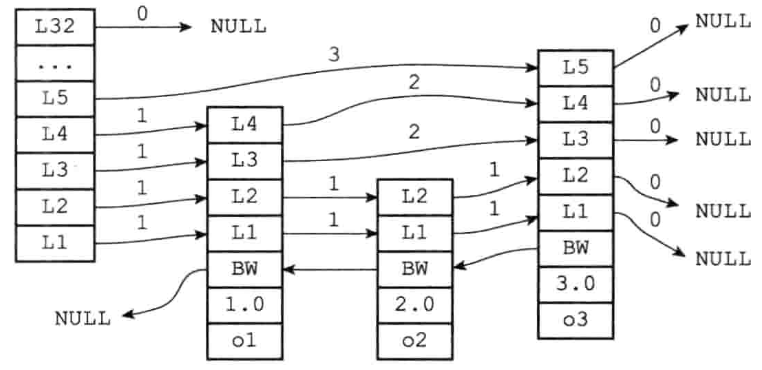
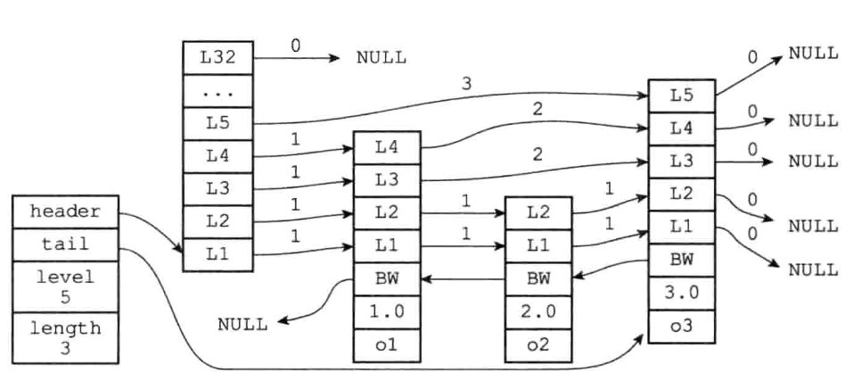

# 跳表

跳跃表（SkipList）是一种有序数据结构，它通过在每个节点中维持多个指向其他节点的指针，从而达到快速访问节点的目的。跳表支持平均O(logN)、最坏O(N)复杂度的结点查找，还可以通过顺序性操作来批量处理节点。

> 平衡树 OR 跳跃表？
>
> 在大部分情况下，跳跃表的效率可以和平衡树相媲美，并且因为跳跃表的实现比平衡树要来得更为简单，所有有不少程序都使用跳表来代替平衡树。

Redis中使用到跳表的地方，一个是实现有序集合建，一个是在集群节点中用作内部数据结构。


# 一、跳跃表节点

`<server.h>/zskiplistNode` 

```c
/* ZSETs use a specialized version of Skiplists */
typedef struct zskiplistNode {
  // 成员对象
  robj *obj;
  // 分值
  double score;
  // 后退指针
  struct zskiplistNode *backward;
	// 层级
  struct zskiplistLevel {
    // 前进指针
    struct zskiplistNode *forward;
    // 跨度
    unsigned int span;
  } level[];
} zskiplistNode;
```

## 1. 层级

跳表节点的level数组可以包含多个元素，每个元素都包含一个指向其他节点的指针，程序可以通过这些层来加快访问其他节点的速度。一般来说，层级的数量越多，访问其他节点的速度越快。

每一次创建一个新跳表节点的时候，程序都根据幂次定律（power law，越大的数出现的概率越小）随机生成一个介于1和32之间的值作为level数组的大小。

【栗子🌰】「不同层高的节点」



## 1.2 前进指针

每个层级都有一个指向表尾方向的前进指针，即`level[i].forward`，用于从表头向表尾方向访问节点。

【栗子🌰】「遍历跳表」（下图虚线表示了遍历路径）



1. 首先访问跳表的表头，然后从第四层的前进指针移动到表中的第二个节点
2. 在第二个节点时，沿第二层的前进指针移动到表中的第三个节点
3. 在第三个节点时，沿第二层的前进指针移动到表中的第四个节点
4. 在第四个节点时，沿着第二层的前进指针移动时，发现是NULL，这是就已经到达了跳表的表尾了，于是，结束此次遍历


## 1.3 跨度

层级的跨度，即`level[i].span`属性，用于记录两个节点之间的距离

- 两个节点之间的跨度越大，他们相距得就越远
- 指向NULL的所有前进指针的跨度都为0，因为它们都没有连向任何节点

📢注意：跨度和遍历操作没有直接关系，遍历操作只使用前进指针就可以完成了。跨度属性实际上是用来计算排位（rank）的，即在查找某个节点的过程中，将沿途访问过的层级的跨级记录起来，得到的结果就是目标节点在跳表中的排位

【栗子1🌰】「计算节点的排位」



上图虚线标记了在跳表中查找分值为3.0、成员对象为o3的节点是时，沿途经历的层级，即查找的过程只经过了一个层，并且层级的跨度为3，所以目标节点在跳表中的排位为3

【栗子2🌰】「计算节点的排位」



上图虚线标记了在跳跃表中查找分值为2.0、成员对象为o2的节点时，沿途经历的层级，即在查找节点的过程经过了两个跨度为1的节点 ，因此可以计算出，目标节点在跳跃表中的排位为2


## 1.4 后退指针

节点的后退指针用于从表尾向表头访问节点，跟可以一次性跳过多个节点的前进指针不同，每个节点只有一个后退指针，所以每次只能后退至前一个节点。

【栗子🌰】「从表尾向表头方向遍历跳表」



上图虚线表示从表尾向表头遍历跳表中的所有节点，首先通过跳表的`tail`指针访问表尾节点，然后依次通过后退指针访问前一个节点，直至遇到指向NULL的后退指针，遍历结束。


## 1.5 分值和成员

- 节点的分值（`score`属性）是一个`double` 类型的浮点数，跳跃表中的所有节点都按分值从小到大来排序
- 节点的成员对象（`obj`属性）是一个指针，它指向一个字符串对象，而字符串对象则保存着一个SDS值

📢注意：在同一个跳表中，各个节点保存的成员对象必须是唯一的，但是多个节点保存的分值可以相同，分值相同的结点将按照成员对象在字典序中的大小来进行排序，成员对象较小的结点会排在靠近表头的方向。

【栗子🌰】「三个带有相同分值的跳跃表节点」



在上图中，三个跳跃表节点都保存了相同的分值10086. 0，但保存成员对象o1的节点却排在保存成员对象o2 和o3的节点之前，而保存成员对象o2 的节点又排在保存成员对象o3的节点之前，因此，o1、o2、o3 三个成员对象在字典中的排序为o1<=o2<=o3。


# 二、跳跃表

实际上，仅靠多个跳跃表节点就可以组成一个跳跃表

【栗子🌰】「由多个跳表节点组成的跳表」



但是在Redis中，是通过使用`zskiplist`结构来持有这些节点，这么实现使得可以更方便地对整个跳表进行处理，比如快速访问跳表的表头和表尾节点、快速获取跳表的长度等信息

 `<server.h>/zskiplist`

```c
typedef struct zskiplist {
	// 表头节点和表尾节点
  struct zskiplistNode *header, *tail;
  // 表中节点的数量（表的长度）
  unsigned long length;
  // 表中层数最大的节点的层数
  int level;
} zskiplist;
```

【栗子🌰】「带有zskiplist结构的跳跃表」



- 通过`header`和`tail`两个指针，使得定位表头节点和表尾节点的时间复杂度为O(1)

- 通过`length`属性，可以在O(1)的时间复杂度内获取跳表的长度

- `level`属性用于在O(1)时间复杂度内获取跳表中层级最大的那个节点的层级数量

  📢注意：表头节点的层高不在计算之内
