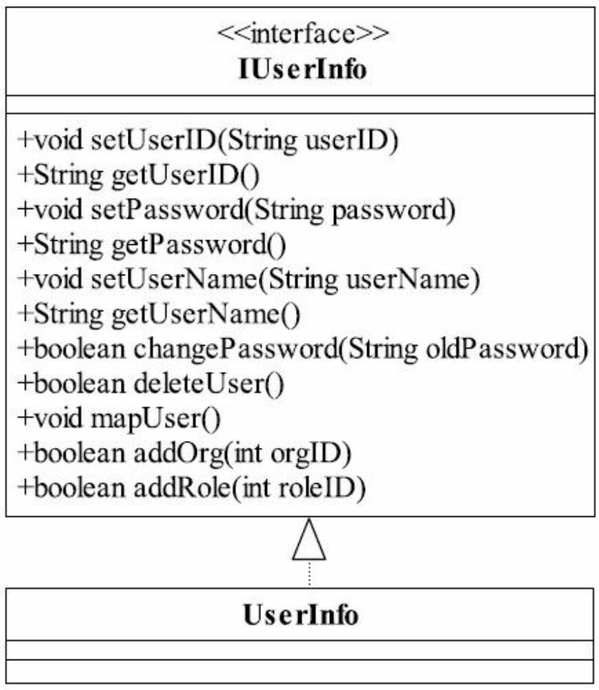
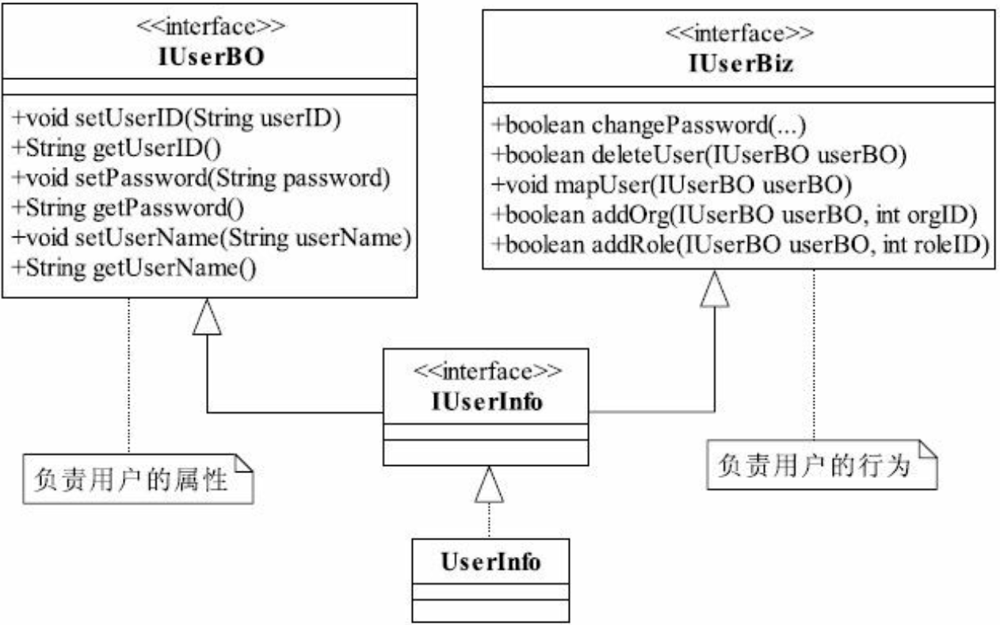
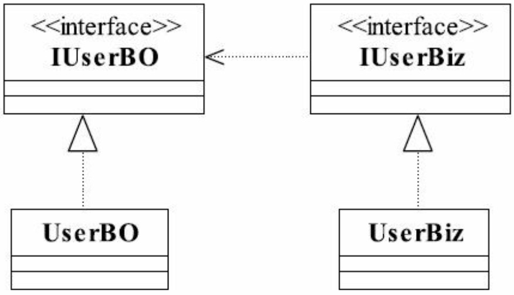
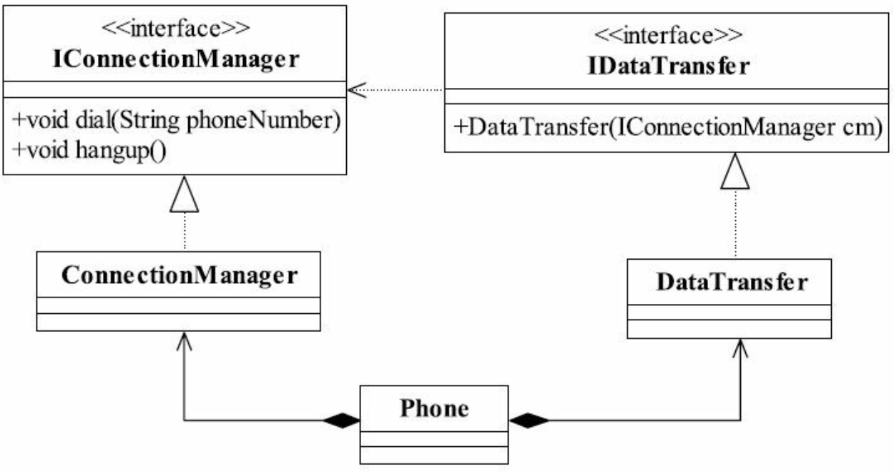
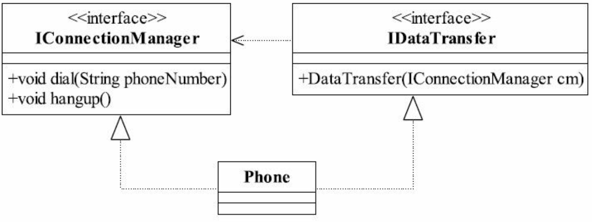
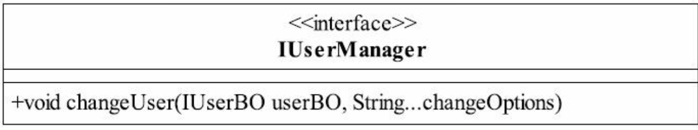
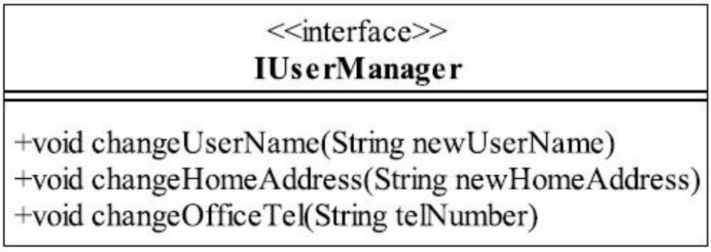

# 6大设计原则


# 一、单一职责原则

单一职责原则 (Single Responsibility Principle, SRP)的定义：**应该有且仅有一个原因引起类的变更**，SRP原话解释：There should never be more than one reason for a class to change.

## 【栗子1🌰】

「用户信息维护类图」❎



「职责划分之后的类图」✅



「项目中常用的SRP类图」




## 【栗子2🌰】


电话通话时存在4个过程：拨号、通话、回应、挂断

```java
public interface IPhone {
  // 拨通电话
  void dial(String phoneNumber);
  // 通话
  void chat(Object o);
  // 通话完毕，挂电话
  void hangup();
}
```

上述接口设计<font style="color:green">接近</font>完美。单一职责原则要求一个接口或者类只有一个原因引起变化，也就是一个接口或者类只有一个职责。

`IPhone`接口包含了两个职责：

- 协议管理：`dial()`和`hangup()`方法实现的是协议管理，分别负责拨号接通和挂机
- 数据传送：`chat()`实现的是数据的传送

协议接通的变化和数据传送的变化都会引起这个接口或者实现类的变化，但是这两个职责之间相互不影响 => 考虑拆成两个接口

「职责分明的电话类图」




上述类图就完全满足了单一职责原则的要求了，每个接口职责分明，结构清晰。但是一个手机类要把`ConnectionManager`和`DataTransfer`组合在一起才能使用，组合是一种强耦合关系，二者之间都有共同的生命周期，显然这么设计增加了复杂性。

「简洁清晰、职责分明的电话类图」



上述的设计才是完美的，一个类实现了两个接口，把两个职责融合在一个类中。

> 此处都是面向接口编程，对外暴露的是接口而不是实现类。


『总结』单一职责原则的好处

- 类的复杂性降低，实现实现职责都有清晰明确的定义
- 可读性提高，复杂性降低，可读性提高
- 可维护性提高
- 变更引起的风险降低，变更是必不可少的，如果接口的单一职责做的优秀，一个接口修改只对相应的实现类有影响，对其他接口无影响，这对系统的可维护性和扩展项都有很大的帮助


📢注意：单一职责原则只是提出了一个编写程序的标准，用「职责」或者「变化原因」来衡量接口或者类设计得是否优良，但是这二者都是不可度量，因项目而异，因环境而异


## 扩展

单一职责适用于接口、类，同样也适用于方法，即一个方法尽可能做一件事情。例如：一个方法修改用户密码，不要把这个方法放到「修改用户信息」的方法中，这个方法的颗粒度很粗。

「一个方法承担多个职责」



「一个方法承担一个职责」



如上图设计，每个方法的职责清晰明确，不仅开发简单，也利于日后维护。


# 二、里氏替换原则

在面向对象的语言中，继承是必不可少的

继承的优点：

1. 代码共享，减少创建类的工作量，每个子类都拥有父类的方法和属性
2. 提高代码的重用性
3. 子类可以形似父类，但又异于父类
4. 提高代码的可扩展性
5. 提高产品或者项目的开放性

继承的缺点：

1. 继承是侵入性的。只要继承，就必须拥有父类的所有属性和方法
2. 降低代码的灵活性。子类必须拥有父类的属性和方法
3. 增强了耦合性。当父类的常量、变量和方法修改时，需要考虑子类的修改，很有可能造成大段代码的重构


解决方案：引入里氏替换原则 (Liskov Substitution Principle, LSP)

## 定义

1. （最正宗）If for each object o1 of type S there is an object of type T subch that for all programs P defined in terms of T, the behavior of P is unchanged when o1 is substituted for o2 then S is a subtype of T. 如果对每一个类型为S的对象o1，都有类型为T的对象o2，是的以T定义的所有程序P在所有的对象o1都代换成o2时，程序P的行为没有发生变化，那么类型S是类型T的子类型

2. （最清晰明确）Functions that use pointers or refrences to base classes must be able to use objects of objects of derived classed without knowing it. 所有引用基类的地方必须能透明地使用其子类的对象。

   通俗来说，只要父类能出现的地方，子类就可以出现，而且替换为子类也不会产生任何错误或者异常，这对于使用者来说是无感的。但是反过来就不行了，有子类出现的地方，父类就未必能适应。


## 理解

1）子类必须完全实现父类的方法

日常使用场景：定义接口或者抽象类，编码实现，调用类则直接传入接口或者抽象类

📢注意：在类中调用类时，务必要使用父类或接口，如果不能使用父类或者接口，则说明类的设计已经违背了LSP原则

📢注意：如果子类不能完整的实现父类的方法，或者父类的某些方法在子类中已经发生“畸变”，则建议断开父子继承关系，采用依赖、聚合、组合等关系替代。


2）子类可以有自己的个性

子类可以由自己的方法和属性。因为里氏替换原则可以正着用，但是不能反着用。在子类出现的地方，父类未必就能胜任。


3）覆盖或实现父类的方法时输入参数可以被放大

4）覆写或实现父类的方法时输出结果可以被缩小


# 三、依赖倒置原则

## 定义

依赖倒置原则（Dependence Inversion Principle, DIP）

- High level modules should not depend upon low level modeules. Both should depend upon abstractions. 高层模块不应该依赖低层模块，两者都应该依赖其抽象。
- Abstractions should not depend upon details. 抽象不应该依赖细节。
- Details should depend upon abtractions. 细节应该依赖抽象。

针对于Java来说，抽象就是指接口或抽象类，细节就是指实现类。依赖倒置原则在Java中的表现就是：

- 模块间的依赖通过抽象发生，实现类之间不发生直接的依赖关系，其依赖关系是通过接口或者抽象类产生的
- 接口或者抽象类不依赖于实现类
- 实现类依赖接口或者抽象类

=> 更加精简的定义：面向接口编程——OOD (Object-Oriented Design，面向对象设计)的精髓之一


## 依赖的三种写法

1. 构造函数传递依赖对象
2. Setter方法传递依赖对象
3. 接口声明依赖对象


## 实践

依赖倒置原则的本质就是通过抽象（接口或者抽象类）使各个类或者模块的实现彼此独立，不互相影响，实现模块间的松耦合。在实际项目中，只需要遵循下述的几个规则：

- 每个类尽量都有接口或者抽象类，或者抽象类和接口两者都具备
- 变量的表面类型尽量是借口或者是抽象类
- 任何类都不应该从具体类派生
- 尽量不要覆写基类的方法
- 结合里氏替换原则使用

=> 接口负责定义public属性和方法，并且声明与其他对象的依赖关系，抽象类负责公共构造部分的实现，实现类准确的实现业务逻辑，同时在适当的时候对父类进行细化。


## 理解

正置：依赖正置就是类间的依赖是实实在在的实现类间的依赖，也就是面向实现编程

倒置：编写程序需要的是对现实世界的事物进行抽象，抽象的结果就是有了抽象类和接口，然后我们根据系统设计的需要产生了抽象间的依赖，代替了人们传统思维中的事物间的依赖


# 四、接口隔离原则

## 定义

接口分类：

1. 实例接口（Object Interface），在Java中声明一个类，然后使用new关键字产生一个实例，它是对一个类型事物的描述，这是一种接口

   【栗子🌰】

   `Person zhangSan = new Person()`，zhangSan这个实例要遵从的标准就是Person这个类，Person类就是zhangSan的接口

2. 类接口（Class Interface），Java中使用关键字interface定义的接口

隔离定义：

- Clients should not be forced to depend upon interfaces that they don't use. 客户端不应该依赖它不需要的接口
- The dependency of one class to another one should depend upon the smallest possible interface. 类间的依赖关系应该建立在最小的接口上

=> 建议单一接口，不要建立臃肿庞大的接口 => 接口尽量细化，同时接口中的方法尽量少


## 理解

接口隔离原则是对接口进行规范约束，其包含以下四层含义

- 接口要尽量小

  📢注意：根据接口隔离原则拆分接口时，首先必须满足单一职责原则

- 接口要高内聚

  要求在接口中尽量少的公布public方法，接口是对外的承诺，承诺越少对系统的开发越有利，变更的风险也就越少，同时也有利于降低成本。

- 定制服务

  只提供访问者需要的方法

- 接口设计是有限度的


## 实践

接口隔离原则是对接口的定义，同时也是对类的定义，接口和类尽量使用原子接口或原子类来组装。

原子划分可以根据以下几个原则来衡量：

1. 一个接口只服务于一个子模块或者业务逻辑
2. 通过业务逻辑压缩接口中的public方法
3. 已经被污染了的接口，尽量去修改，若变更的风险较大，则采用适配器模式进行转化处理
4. 了解环境，拒绝盲从


# 五、迪米特法则

## 定义

迪米特法则（Law of Demeter，LoD）也被称为最少知识原则（Least Knowledge Principle， LKP），即一个对象应该对其他对象有最少的了解。


## 理解

迪米特法则对类的低耦合提出了明确的要求，其包含以下的四层含义：

1. 只和朋友交流

   Only talk to your immediate friends（只和直接的朋友通信），两个对象之间的耦合就成为朋友关系

   朋友的定义：出现在成员变量、方法的输入输出参数中的类成为成员朋友类，而出现在方法体内部的类不属于朋友类

   📢注意：一个类只和朋友交流，不与陌生类交流，不要出现 `getA().getB().getC().getD()`这种情况（在一种极端的情况下允许出现这种 访问，即每一个点号后面的返回类型都相同），类与类之间的关系是建立在类间的，而不是方法间，因此一个方法尽量不引入一个类中不存在的对象，当然，JDK API提供的类除外。

2. 朋友间也是有距离的

   一个类公开的public属性或方法越多，修改时涉及的面也就越大，变更引起的风险扩散也就越大。因此，为了保持朋友类间的距离，在设计时需要反复衡量：是否还可以再减少public方法和属性，是否可以修改为private、package-private（包类型，在类、方法、变量前不加访问权限，则默认为包类型）、protected等访问权限，是否可以加上final关键字等。

   📢注意：迪米特法则要求类“羞涩”一点，尽量不要对外公布太多的public方法和非静态的public变量，尽量内敛，多使用private、package-private、protected等访问权限。

3. 是自己的就是自己的

   如果一个方法放在本类中，既不增加类间关系，也对本类不产生负面影响，
   那就放置在本类中。

4. 谨慎使用Serializable


## 实践

迪米特法则的核心观念就是类间解耦，弱耦合，只有弱耦合了以后，类的复用率才可以提高。其要求的结果就是产生了大量的中转或跳转类，导致系统的复杂性提高，同时也为维护带来了难度。

在实际应用中，如果一个类跳转两次以上才能访问到另一个类，就需要想办法进行重构了，为什么是两次以上呢？因为一个系统的成功不仅仅是一个标准或是原则就能够决定的，有非常多的外在因素决定，跳转次数越多，系统越复杂，维护就越困难，所以只要跳转不超过两次都是可以忍受的，这需要具体问题具体分析。


# 六、开闭原则

## 定义

Software entities like classes,modules and functions should be open for extension but closed for modifications. 一个软件实体如类、模块和函数应该对扩展开放，对修改关闭。


## 理解

📢注意：开闭原则对扩展开放，对修改关闭，并不意味着不做任何修改，低层模块的变更，必然要有高层模块进行耦合，否则就是一个孤立无意义的代码片段。

变化归纳：

1. 逻辑变化：可以通过修改原有类中的方法的方式来完成，前提条件是所有依赖或关联类都按照相同的逻辑处理。
2. 子模块变化：一个模块变化，会对其他的模块产生影响，特别是一个低层次的模块变化必然引起高层模块的变化，因此在通过扩展完成变化时，高层次
   的模块修改是必然的
3. 可见视图变化


## 实践

1）抽象约束

1. 通过接口或抽象类约束扩展，对扩展进行边界限定，不允许出现在接口或抽象类中不存在的public方法
2. 参数类型、 引用对象尽量使用接口或者抽象类，而不是实现类
3. 抽象层尽量保持稳定，一旦确定即不允许修改

2）元数据（metadata）控制模块行为

​	元数据：描述环境和数据的数据，就是配置参数

3）规定项目章程

4）封装变化

1. 将相同的变化封装到一个接口或抽象类中
2. 不同的变化封装到不同的接口或抽象类中，不应该有两个不同的变化出现在同一个接口或抽象类中