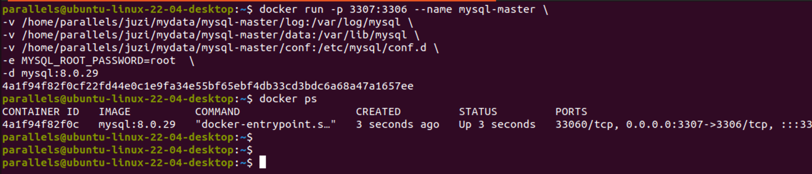

# Docker搭建MySQL主从复制集群


# MySQL主从复制的原理

MySQL主从复制是一种常见的数据库复制技术，它基于主数据库master将数据的更改事件传播到一个或多个从数据库slave。

## 基本原理

1. 主数据库记录二进制日志`Binary Log`：主数据库将所有的数据更改操作（如插入、更新、删除）以二进制日志的形式记录下来。

2. 从数据库连接到主数据库：从数据库与主数据库建立连接，并请求成为主数据库的从属节点。

3. 主数据库发送二进制日志：主数据库将记录的二进制日志传送给从数据库，可以通过两种方式进行传送：

   - 基于语句复制(Statement-Based Replication)：主数据库将每条执行的SQL语句以文本形式发送给从数据库，从数据库重新执行相同的SQL语句来实现数据更新。
   - 基于行复制(Row-Based Replication)：主数据库将更改的行数据以二进制格式发送给从数据库，从数据库根据接收到的行数据进行相应的更新。

4. 从数据库应用二进制日志：从数据库接收到主数据库的二进制日志后，将其应用到本地数据库中，以实现数据的更新。

5. 从数据库持续同步：从数据库会保持与主数据库的连接，并定期请求主数据库的二进制日志，以保持数据的同步。


## 主从复制的好处

- 数据备份和容灾：从数据库可以作为主数据库的备份，以防止主数据库发生故障时丢失数据。同时，从数据库也可以用于分担主数据库的读取负载。
- 数据分析和报表生成：从数据库可以用于数据分析和报表生成，以避免对主数据库的读取操作影响主要业务。
- 数据分布和就近访问：从数据库可以部署在不同的地理位置，以实现就近访问和数据分布的需求。

📢注意：MySQL主从复制是异步的过程，因此在复制过程中可能会存在一定的延迟。此外，主数据库和从数据库之间需要进行一定的网络配置和权限设置，以确保安全和正确的复制。


# Docker搭建MySQL主从复制

> 环境：
>
> - Parallels Desktop
> - Ubuntu 22.04 ARM64
> - Docker 23.0.6
> - MySQL 8.0.29

1）新建主数据库配置

在要挂载容器卷的目录下`/home/parallels/juzi/mydata/mysql-master/conf`创建`my.cnf`文件

```ini
[mysqld]
## 设置server_id，同一局域网中需要唯一
server_id=101 
## 指定不需要同步的数据库名称
binlog-ignore-db=mysql  
## 开启二进制日志功能
log-bin=mall-mysql-bin  
## 设置二进制日志使用内存大小（事务）
binlog_cache_size=1M  
## 设置使用的二进制日志格式（mixed,statement,row）
binlog_format=mixed  
## 二进制日志过期清理时间。默认值为0，表示不自动清理。
expire_logs_days=7  
## 跳过主从复制中遇到的所有错误或指定类型的错误，避免slave端复制中断。
## 如：1062错误是指一些主键重复，1032错误是因为主从数据库数据不一致
slave_skip_errors=1062
```

2）新建主数据库实例

```sh
docker run -p 3307:3306 --name mysql-master \
-v /home/parallels/juzi/mydata/mysql-master/log:/var/log/mysql \
-v /home/parallels/juzi/mydata/mysql-master/data:/var/lib/mysql \
-v /home/parallels/juzi/mydata/mysql-master/conf:/etc/mysql/conf.d \
-e MYSQL_ROOT_PASSWORD=root  \
-d mysql:8.0.29
```

> 📢注意：数据卷挂载根据实际的环境来设置



3）进入mysql-master容器内部

```sh
docker exec -it mysql-master /bin/bash
```

```
mysql -uroot -proot
```


4）master容器实例内创建数据同步用户

创建用户

```sql
CREATE USER 'slave'@'%' IDENTIFIED WITH sha256_password BY '123456';
```

> 📢注意：MySQL8以上的版本，创建用户时，必须明确指定认证插件sha256_password；

分配权限

```sql
GRANT REPLICATION SLAVE, REPLICATION CLIENT ON *.* TO 'slave'@'%';
```


5）新建从数据库配置

在要挂载容器卷的目录下`/home/parallels/juzi/mydata/mysql-slave/conf`创建`my.cnf`文件

```ini
[mysqld]
## 设置server_id，同一局域网中需要唯一
server_id=102
## 指定不需要同步的数据库名称
binlog-ignore-db=mysql  
## 开启二进制日志功能，以备Slave作为其它数据库实例的Master时使用
log-bin=mall-mysql-slave1-bin  
## 设置二进制日志使用内存大小（事务）
binlog_cache_size=1M  
## 设置使用的二进制日志格式（mixed,statement,row）
binlog_format=mixed  
## 二进制日志过期清理时间。默认值为0，表示不自动清理。
expire_logs_days=7  
## 跳过主从复制中遇到的所有错误或指定类型的错误，避免slave端复制中断。
## 如：1062错误是指一些主键重复，1032错误是因为主从数据库数据不一致
slave_skip_errors=1062  
## relay_log配置中继日志
relay_log=mall-mysql-relay-bin  
## log_slave_updates表示slave将复制事件写进自己的二进制日志
log_slave_updates=1  
## slave设置为只读（具有super权限的用户除外）
read_only=1
```


5）创建从数据库实例

```sh
docker run -p 3308:3306 --name mysql-slave \
-v /home/parallels/juzi/mydata/mysql-slave/log:/var/log/mysql \
-v /home/parallels/juzi/mydata/mysql-slave/data:/var/lib/mysql \
-v /home/parallels/juzi/mydata/mysql-slave/conf:/etc/mysql/conf.d \
-e MYSQL_ROOT_PASSWORD=root  \
-d mysql:8.0.29
```


6）在主数据库查看主从同步状态

```sql
show master status;
```


7）进入mysql-slave容器内部

```sh
docker exec -it mysql-slave /bin/bash
```

```sh
mysql -uroot -proot
```


8）在从数据库配置主从复制

> 命令：change master to master_host='宿主机ip', master_user='slave', master_password='123456', master_port=3307, master_log_file='\${File}', master_log_pos=\${Position}, master_connect_retry=30;
>
> 参数解释：
>
> - `master_host`：指定主库的 IP 地址或主机名。
> - `master_user`：指定主库的用户名。
> - `master_password`：指定主库的密码。
> - `master_port`：指定主库使用的端口号，默认为 3306。
> - `master_log_file`：指定主库当前正在写入的二进制日志文件名。
> - `master_log_pos`：指定主库当前正在写入的二进制日志文件中的位置。
> - `master_connect_retry`：指定从库在连接主库失败后重试的时间间隔，单位为秒，默认为 60 秒。
>
> master_log_file和master_log_pos由第6步查询可知
>
> master_user和master_password由第4步创建

```sh
change master to master_host='10.211.55.3', master_user='slave', master_password='123456', master_port=3307, master_log_file='mall-mysql-bin.000003', master_log_pos=711, master_connect_retry=30;
```


9）在从数据库查看主从同步状态

```sql
show slave status \G;
```


10）在从数据库开启主从同步

```sql
start slave;
```

11）在从数据库查看主从同步状态

```sql
show slave status \G;
```


> 📢注意：如果`Slave_IO_Running`显示是`Connecting`状态，可以关闭防火墙再开启主从复制哦~


12）在主数据库创建数据库、创建表、插入数据，查看从数据库的状态即可，发现此时主从已经同步了。
