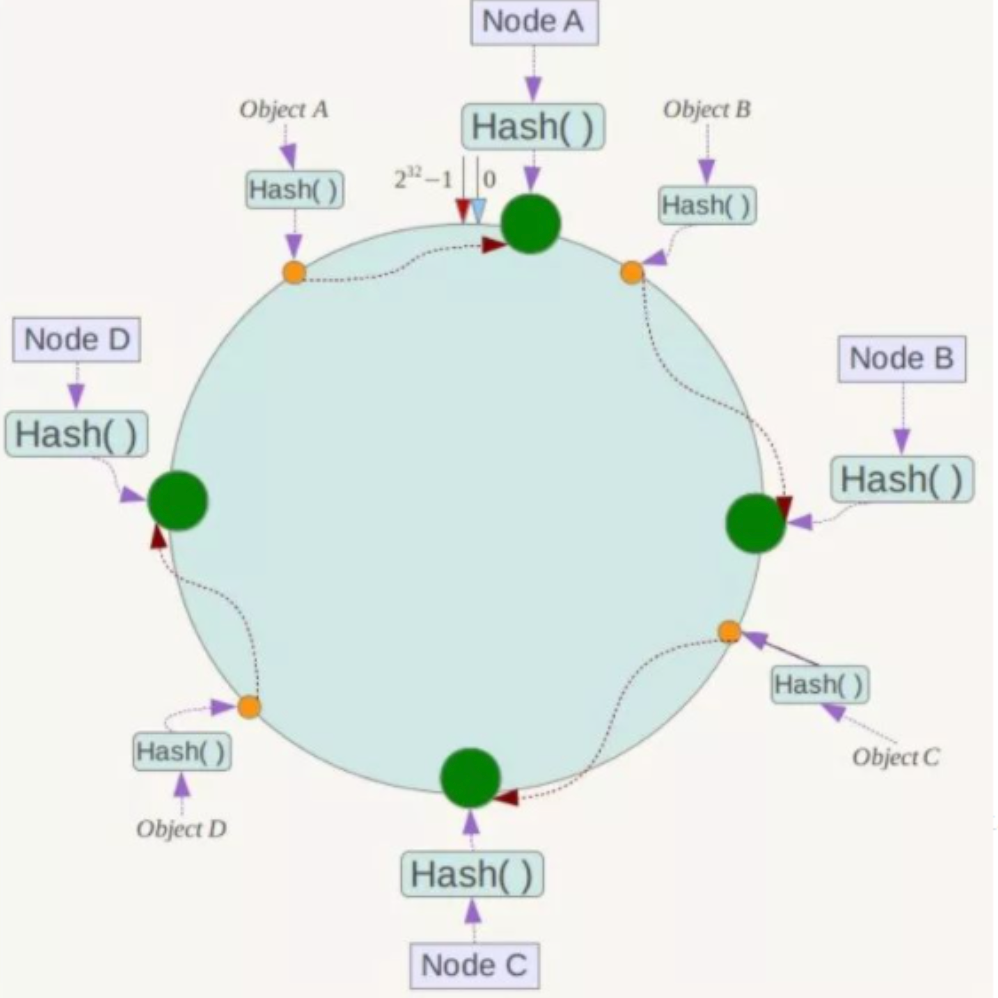
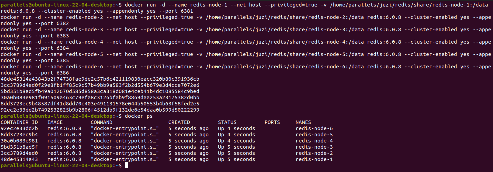
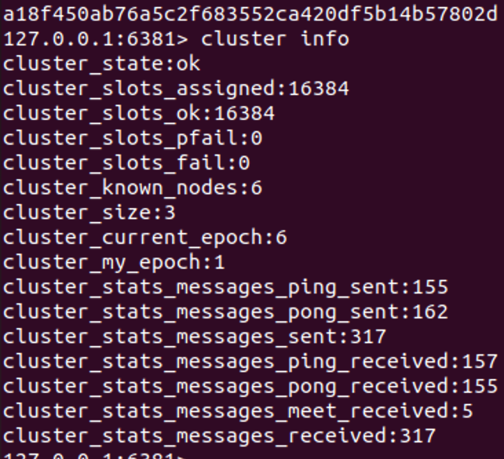

# Docker 搭建 Redis 分布式集群

# 面试题：1~2亿条数据需要缓存，如何设计缓存策略？

单机是不可能单机的啦，这辈子都是不可能单机的啦~，肯定是需要分布式缓存！使用Redis如何落地呢？

## 策略一：哈希取余分区


假设有3台机器构成一个集群，用户每次读写操作都是根据公式：`hash(key) % N个机器台数`计算出哈希值，用来决定数据映射到那一个节点上。

### 优点

- 简单粗暴、直接有效，只需要预估好数据规划好节点就能保证一段时间的数据支撑
- 使用Hash算法让固定的一部分请求落到同一台服务器上，这样每一台服务器固定处理一部分请求，并维护这些请求的信息，起到负载均衡和分而治之的作用

### 缺点

原来规划好的结点，进行扩容或者缩容都是比较麻烦的。不管是扩容还是缩容，每次数据变动导致节点变动，映射关系都需要重新计算，在服务器个数固定不变时没有问题，如果需要弹性扩容或者故障停机的情况下，原来的取模公式就会发生变化`hash(key)/N` => `hash(key) / ?`，此时地址经过取余运算，结果也会发生很大变化，根据公式获取的服务器节点也会变得不可控。若某个Redis节点宕机了，由于机器台数的变化，会导致hash取余全部数据重新洗牌。


## 策略2：一致性哈希算法分区

提出一致性哈希算法的目的是当服务器个数发生变化时，尽可能的减少影响客户端到服务器的映射关系。

### 三大步骤

#### 1）一致性哈希环

一致性哈希算法必然有hash函数并按照算法生成hash值，这个算法的所有可能hash值会构成一个全量集，这个集合可以成为一个hash空间【0 ~ 2^32^-1】，这是一个线性空间，但是在算法中，我们可以通过适当的逻辑控制将他首尾相连`0 = 2^32`，使得它在逻辑上形成一个环形空间。

【栗子🌰】


#### 2）节点映射

将集群中的各个IP节点映射到环上的某一个位置。将各个服务器（IP、主机名等）使用hash算法进行hash取余，确定每台服务器在哈喜欢上的位置

【栗子🌰】4个节点A、B、C、D，经过IP地址哈希计算之后，在环上的位置如下图：


#### 3）key的落键规则

当我们需要存储一个KV键值对的时候，首先计算key的hash值确定此数据在环上的位置，从此位置沿环顺时针“行走”，第一台遇到的服务器就是其应该定位到的服务器，并将该键值对存储在该节点上。

【栗子🌰】ObjectA、ObjectB、ObjectC、ObjectD四个对象，经过哈希计算后，在环空间上的位置如下：根据一致性Hash算法，数据A会被定为到Node A上，B被定为到Node B上，C被定为到Node C上，D被定为到Node D上




### 优点

#### 1、容错性

假设NodeC宕机，此时对象A、B、D不会受到影响，只有C对象被重定位到NodeD。在一致性Hash算法中，如果一台服务器不可用，则受影响的数据仅仅是此服务器到其环空间中前一台服务器（即沿着逆时针方向行走遇到的第一台服务器）之间数据，其它不会受到影响。

【栗子🌰】C节点宕机了，受到影响的只是B、C之间的数据，并且这些数据会转移到D进行存储。


#### 2、扩展性

由于数据量增加导致需要增加一台节点NodeX，X的位置在A和B之间，受到影响的也就是A到X之间的数据，重新把A到X的数据录入到X上即可，不会导致hash取余全部数据重新洗牌


### 缺点

一致性Hash的数据倾斜问题：一致性Hash算法在服务**节点太少时**，容易因为节点分布不均匀而造成**数据倾斜**（被缓存的对象大部分集中缓存在某一台服务器上）问题

【栗子🌰】两台服务器节点


## 策略3：哈希槽分区

解决均匀分配的问题，在数据和节点之间又加入了一层，把这层称为哈希槽（slot），用于管理数据和节点之间的关系，现在就相当于节点上放的是槽，槽里放的是数据。


- 槽解决的是粒度问题，相当于把粒度变大了，便于数据移动
- 哈希解决的是映射问题，使用key的哈希值来计算所在的槽，便于数据分配

一个集群只能有16384个槽，编号0-16383（0\~2^14^-1）。这些槽会分配给集群中的所有主节点，分配策略没有要求，可以指定分配，集群会记录节点和槽的对应关系。求解槽位`slot = CRC16(key) % 16384`。以槽为单位移动数据，因为槽的数目是固定的，处理起来比较容易，解决了数据移动问题。


> 为什么Redis要设计16384个槽位？
>
> [Redis作者回答](https://github.com/redis/redis/issues/2576)
>
> - 如果槽位为65536，发送心跳信息的消息头达8k，发送的心跳包过于庞大
> - redis的集群主节点数量基本不可能超过1000个
> - 槽位越小，节点少的情况下，压缩比高


# Docker搭建Redis集群

> 环境：
>
> - Parallels Desktop
> - Ubuntu 22.04 ARM64
> - Docker 23.0..6
> - Redis 6.0.8


## 3主3从Redis集群搭建

### 1） 启动Docker

```shell
systemctl start docker
```

### 2）新建6个Redis实例

```shell
docker run -d --name redis-node-1 --net host --privileged=true -v /home/parallels/juzi/redis/share/redis-node-1:/data redis:6.0.8 --cluster-enabled yes --appendonly yes --port 6381
docker run -d --name redis-node-2 --net host --privileged=true -v /home/parallels/juzi/redis/share/redis-node-2:/data redis:6.0.8 --cluster-enabled yes --appendonly yes --port 6382
docker run -d --name redis-node-3 --net host --privileged=true -v /home/parallels/juzi/redis/share/redis-node-3:/data redis:6.0.8 --cluster-enabled yes --appendonly yes --port 6383
docker run -d --name redis-node-4 --net host --privileged=true -v /home/parallels/juzi/redis/share/redis-node-4:/data redis:6.0.8 --cluster-enabled yes --appendonly yes --port 6384
docker run -d --name redis-node-5 --net host --privileged=true -v /home/parallels/juzi/redis/share/redis-node-5:/data redis:6.0.8 --cluster-enabled yes --appendonly yes --port 6385
docker run -d --name redis-node-6 --net host --privileged=true -v /home/parallels/juzi/redis/share/redis-node-6:/data redis:6.0.8 --cluster-enabled yes --appendonly yes --port 6386
```

命令说明：

- docker run => 创建并运行docker容器实例
- -d => deamon模式
- --name redis-node-? => redis实例名称
- --net host => 使用宿主机的IP和端口，默认
- --privileged=true => 获取宿主机root权限
- -v /home/parallels/juzi/redis/share/redis-node-1:/data => 容器卷，宿主机地址: docker内部地址
- redis:6.0.8 => redis镜像和版本号
- --cluster-enabled yes => 开启集群
- --appendonly yes => 开启持久化
- --port xxxx => redis启动端口号

【成功启动】




### 3）进入任意一台容器搭建集群环境

「以redis-node-1为例」

进入容器：

```shell
docker exec -it redis-node-1 /bin/bash
```


搭建主从关系：

```shell
redis-cli --cluster create 10.211.55.3:6381 10.211.55.3:6382 10.211.55.3:6383 10.211.55.3:6384 10.211.55.3:6385 10.211.55.3:6386 --cluster-replicas 1
```


『说明』

- --cluster-replicas 1 => 为每个master创建一个slave节点
- 10.211.55.3换成实际的ip地址

进入节点，查看集群状态：

```shell
redis-cli -p 6381
```

```shell
cluster nodes
```


```shell
cluster info
```




## 主从容错，切换迁移

### 1）数据读写存储

以集群方式进入redis节点

```shell
docker exec -it redis-node-1 /bin/bash
```

```shell
redis-cli -p 6381 -c
```


查看集群信息

```sh
redis-cli --cluster check 10.211.55.3:6381
```


### 2）容错切换迁移

查看目前主从节点状况

| master | slave |
| ------ | ----- |
| 6381   | 6385  |
| 6383   | 6384  |
| 6382   | 6386  |

【栗子🌰】

将6381节点停止服务，查看主从状态、集群信息

```shell
docker stop redis-node-1
```


再次启动6381，发现6381并为恢复为主节点，而是从节点

```sh
docker restart redis-node-1
```


恢复原先的3主3从，停止6385再重启6385即可（需要等待一会再重启）

```sh
docker stop redis-node-5
docker restart redis-node-5
```


## 主从扩容

### 1）新建6387、6388两个redis节点

```sh
docker run -d --name redis-node-7 --net host --privileged=true -v /home/parallels/juzi/redis/share/redis-node-7:/data redis:6.0.8 --cluster-enabled yes --appendonly yes --port 6387
docker run -d --name redis-node-8 --net host --privileged=true -v /home/parallels/juzi/redis/share/redis-node-8:/data redis:6.0.8 --cluster-enabled yes --appendonly yes --port 6388
```


### 2）进入6387节点内部

```sh
docker exec -it redis-node-7 /bin/bash
```

### 3）将新增的6387作为master节点加入集群

> redis-cli --cluster add-node 自己实际IP地址:6387 自己实际IP地址:6381
>
> 6387 就是将要作为master新增节点
>
> 6381不固定，只要是集群内部的节点即可

```sh
redis-cli --cluster add-node 10.211.55.3:6387 10.211.55.3:6381
```


### 4）检查集群状态

```sh
redis-cli --cluster check 10.211.55.3:6387
```


### 5）重新分配槽位

> 命令:redis-cli --cluster **reshard** IP地址:端口号

```sh
redis-cli --cluster reshard 10.211.55.3:6381
```


### 6）查看集群状态

```sh
redis-cli --cluster check 10.211.55.3:6387
```


### 7）为主节点6387分配从节点6388

> 命令：redis-cli --cluster add-node ip:新slave端口 ip:新master端口 --cluster-slave --cluster-master-id 新主机节点ID

```sh
redis-cli --cluster add-node 10.211.55.3:6388 10.211.55.3:6387 --cluster-slave --cluster-master-id e08a5553e8074699e85880e9ae96b0552de87274
```


### 8）查看集群状态

```sh
redis-cli --cluster check 10.211.55.3:6387
```


## 主从缩容

目标：从集群中删除6387,6388节点

### 1）检查集群状态获取6388节点ID

```sh
redis-cli --cluster check 10.211.55.3:6387
```


### 2）删除6388节点

> 命令：redis-cli --cluster del-node ip:从机端口 从机6388节点ID

```sh
redis-cli --cluster del-node 10.211.55.3:6388 9757d17ea25201c4b0317aaaf0f3ea714babdb26
```


### 3）清空6387的槽位

「本例中将槽位全部分配给6381，实际可以分配给其他几个主节点」

```sh
redis-cli --cluster reshard 10.211.55.3:6381
```


### 4）检查集群状态

6387节点槽位已经被清空


### 5）删除6387节点

> 命令：redis-cli --cluster del-node ip:端口 6387节点ID

```sh
redis-cli --cluster del-node 10.211.55.3:6387 e08a5553e8074699e85880e9ae96b0552de87274
```

### 6）查看集群状态


