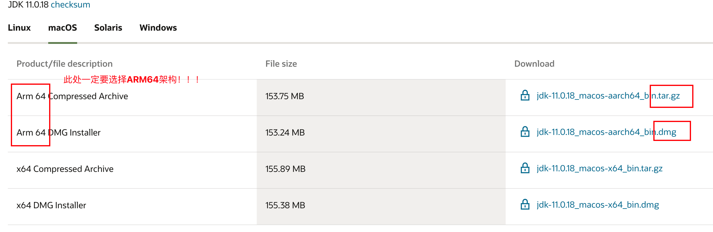
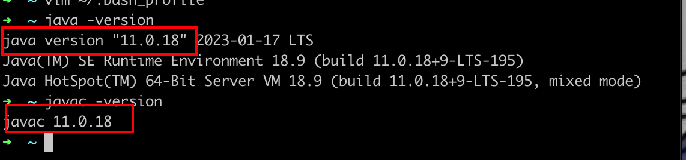

# MacOS 配置JDK环境

> ### 机器环境备注：
>
> - M1 Pro 2021 14英寸

## ×86 Or ARM64？

我们从[JDK下载官网](https://www.oracle.com/sg/java/technologies/downloads/)可以知道JDK是有支持×86架构和ARM架构的，这需要根据我们的机型支持的架构来选择。

因为作者的M1 Pro是运行 macOS 系统的 ARM 架构，那么应该安装适用于 ARM 架构的 JDK，也就是通常所说的 `arm64` 版本。

但是如果你已经安装了适用于 x86 架构的 JDK 版本，也可以在 M1 Pro 上运行，但是它将使用 `Rosetta 2`翻译器来模拟 x86 架构，**会影响性能**。因此，如果你的 M1 Pro 是运行 macOS 系统的 ARM 架构，最好还是安装适用于 ARM 架构的 JDK 版本。

> ## 作者建议：
>
> JDK 8u212 及更高版本提供了针对 ARM64 架构的版本，可以在 ARM64 架构的设备上运行。这些版本提供了对 ARM64 架构设备的本机支持，可以显著提高性能。JDK 8u212 及更高版本的 ARM64 架构版本可从 Oracle 官网上下载。
>
> 需要注意的是，尽管 JDK 8u212 及更高版本提供了针对 ARM64 架构的版本，但官方已经建议用户升级到 **JDK 11 或更高版本**，因为 JDK 11 及更高版本提供了更好的性能和稳定性，并提供了更多的功能和安全性修复。

所以这里我们演示安装JDK11的安装，其他版本的JDK安装步骤大同小异。

## 安装配置流程

### 1、下载JDK

从Oracle官网下载[JDK11](https://www.oracle.com/sg/java/technologies/downloads/#java11-mac)



此处我们选择`dmg`类型的安装包，不为啥，因为方便，几乎是傻瓜式安装。

### 2、安装JDK

安装我们下载好的`dmg`安装包即可

### 3、配置环境变量（重要！！！）

1. 打开终端或者Item2（推荐）

   输入`/usr/libexec/java_home -v 11`，就可以得到JDK11的安装地址

   

   例如这里我们得到的地址就是`/Library/Java/JavaVirtualMachines/jdk-11.jdk/Contents/Home`，这个地址很重要，要保存好

2. 配置环境变量

   1. 在终端输入`vim ~/.bash_profile`，打开环境变量配置文件

   2. 在**英文输入法**下，按下键盘上的`i`，进入编辑模式

   3. 在文件中输入以下内容

      ```bash
      export JAVA_HOME=/Library/Java/JavaVirtualMachines/jdk-11.jdk/Contents/Home
      export PATH=$JAVA_HOME/bin:$PATH:.
      ```

      > 注意📢：上述的`JAVA_HOME`后面的内容需要根据我们上述得到的JDK11的安装地址来定

   4. 按下`esc`键，退出编辑模式

   5. 在**英文输入法**的状态下，输入`:wq`，保存并退出

   6. 在终端输入`source ~/.bash_profile`，使得配置文件生效

      > 注意📢：如果你的终端是`zsh`，而不是`bash`，那么就在`~/.zshrc`文件的末尾添加上`source ~/.bash_profile`，保存退出后，在终端输入`source ~/.zshrc`

3. 检查配置是否完成

   在终端输入 `java -version` 或者 `javac -version`

   

   可以看到我们的JDK11环境已经配置完成了！！!  


## Congratulations !!! 开始Java学习之旅吧~~~