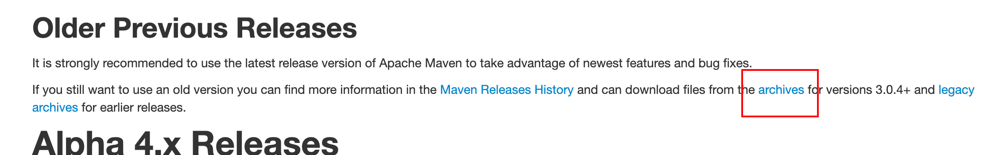
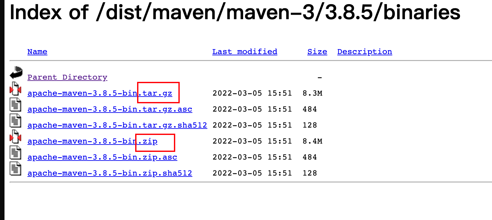
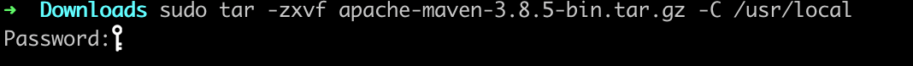
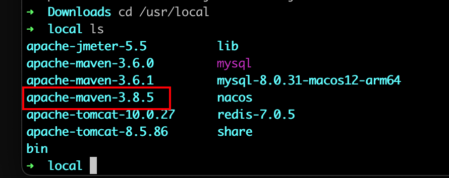
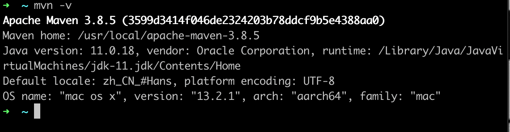

# MacOS 配置Maven环境

> ## 机型
>
> - M1 Pro 2021 14英寸

## 方法一：官网下载配置

### 1、官网下载Maven

1. 访问[maven官网](https://maven.apache.org/download.cgi)选择合适的maven版本下载

2. 在写这篇博客期间，maven官方推荐的版本是3.8.5，所以以这一版本为例

   > 查看以往Maven版本：
   >
   > 

3. 选择`Binaries`，此处`tar.gz`或者`zip`皆可

   

### 2、解压缩

我选择下载的是`tar.gz`版本，此处解压缩在`/usr/local/`目录下，打开终端，将下载的文件解压缩

```sh
tar -zxvf apache-maven-3.8.5-bin.tar.gz -C /usr/local
```

> 此处可能会出现权限不够的情况，所以需要使用管理员权限
>
> ```sh
> sudo tar -zxvf apache-maven-3.8.5-bin.tar.gz -C /usr/local
> ```
>
> 

### 3、配置国内镜像源



可以看到，已经将Maven 3.8.5的版本解锁到/usr/local/目录下了，下面我们需要配置国内镜像源（此处选择阿里云镜像仓库）来提高依赖下载的速度。

1. 首先需要打开`/usr/local/apache-maven-3.8.5/conf/settings.xml`文件

2. 找到`<mirrors></mirros>`标签，将原有的`<mirror></mirror>`注释，添加[阿里云镜像仓库的配置](https://developer.aliyun.com/mvn/guide)

```xml
<mirrors>
    <!-- ... -->
    <!-- <mirror>
      <id>maven-default-http-blocker</id>
      <mirrorOf>external:http:*</mirrorOf>
      <name>Pseudo repository to mirror external repositories initially using HTTP.</name>
      <url>http://0.0.0.0/</url>
      <blocked>true</blocked>
    </mirror> -->
    <!-- 阿里云仓库 -->
      <mirror>
        <id>aliyunmaven</id>
        <mirrorOf>*</mirrorOf>
        <name>阿里云公共仓库</name>
        <url>https://maven.aliyun.com/repository/public</url>
      </mirror>
  </mirrors>
```

随后保存退出即可

### 3、配置环境变量

1. 打开系统环境变量配置文件

   ```sh
   vim ~/.bash_profile
   ```

2. 添加配置

   ```sh
   export MAVEN_HOME=/usr/local/apache-maven-3.8.5
   export PATH=$PATH:$MAVEN_HOME/bin
   ```

   > 注意📢：上述的`MAVEN_HOMR`后面的值为maven的安装目录，需要按实际情况来

3. 配置文件生效

   ```sh
   source ~/.bash_profile
   ```

4. 查看是否配置成功

   ```sh
   mvn -v
   ```

   

## 方法二：Brew安装

> [HomeBrew安装](https://brew.sh/)

### 1、安装

在终端输入

```sh
brew install maven@3.8.5
```

### 2、配置国内镜像源

查看maven安装地址

```sh
brew info maven
```

随后按照方法一的配置镜像源和环境变量即可

