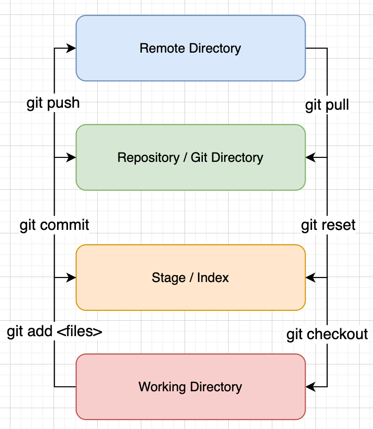
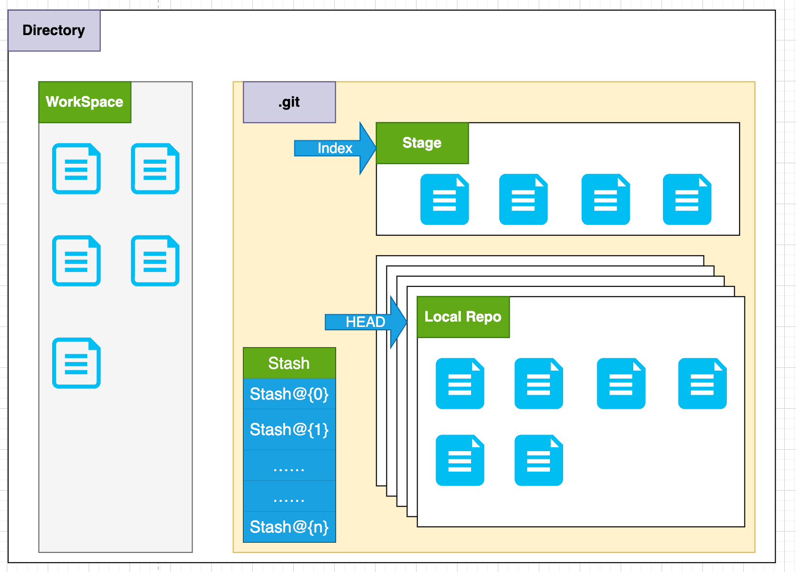
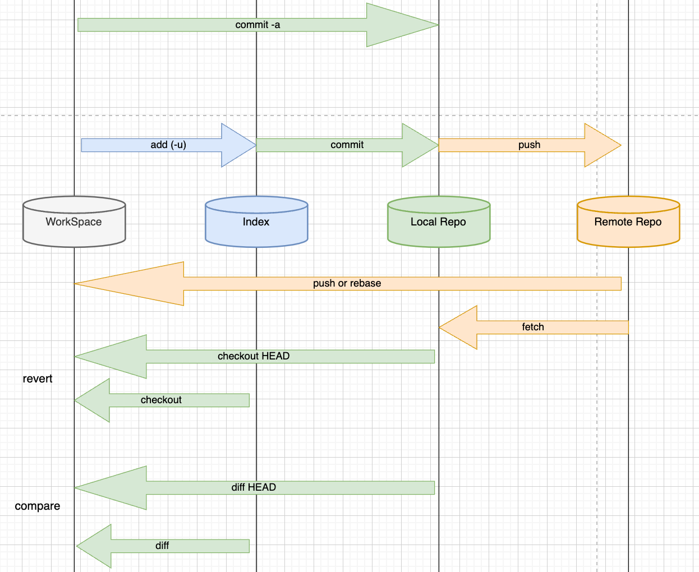

# 由浅入深学Git

# Git 资料

Gitee上有着很全的Git资料：[Address](https://gitee.com/all-about-git)

# Git工作原理

## 四个工作区域

1）本地（Local Dist）

- Working Directory => 工作区：开发时存放项目代码的位置
- Stage / Index => 暂存区 => 用于临时存档改动，本质上它只是一个文件，保存即将提交的文件列表信息
- Repository / Git Direction => 仓库区（本地仓库）：安全存放数据的位置，内部包含开发者提交的所有版本的数据，其中HEAD指向最新commit的版本

2）远程（remote)

- Remote Directory => 远程git仓库：托管代码的服务器（例如：GitHub，Gitee）

## 工作区域之间的关系

## 深入探讨本地的三个区域之间的关系

- Directory => 使用Git管理的一个目录，也就是一个仓库，包含WorkSpace和Git的管理空间
- WorkSpace =>内部存储了 需要通过Git进行版本控制的目录和文件，这些目录和文件组成了WorkSpace
- .git => 内部存放了Git管理信息的目录，在初始化仓库时自动创建
- Stage / Index => 暂存区（待提交更新区），在commit进入Repo之前，开发者可以把所有的更新放在暂存区
- Local Repo => 本地仓库，就是存放在本地的版本库，HEAD指向的分支是当前的开发分支
- Stash：一个工作状态保存栈，用于保存和恢复WorkSpace的临时状态

# Git工作流程

1. 在WorkSpace中添加、修改文件
2. 将需要进行版本控制的文件放入暂存区域
3. 将暂存区域的文件提交到Local Repo

=> Git管理的文件的状态

- 已修改（modified）
- 已暂存（staged）
- 已提交（committed）

