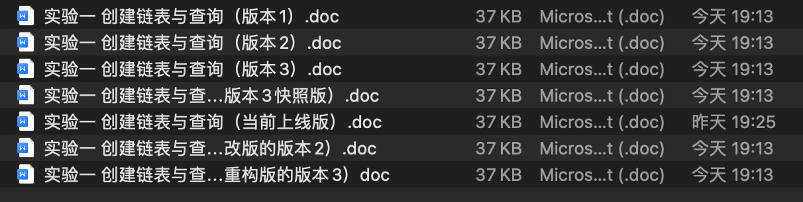
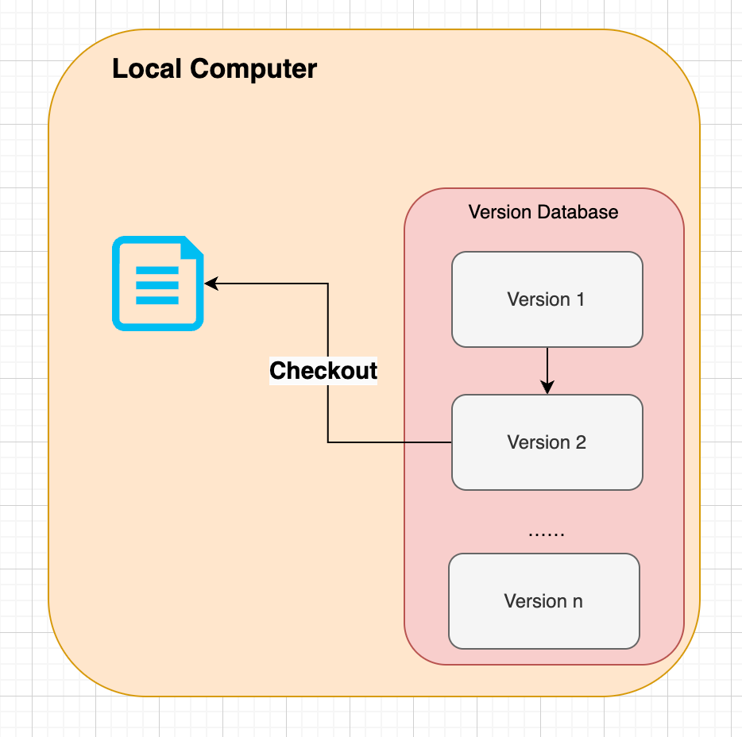
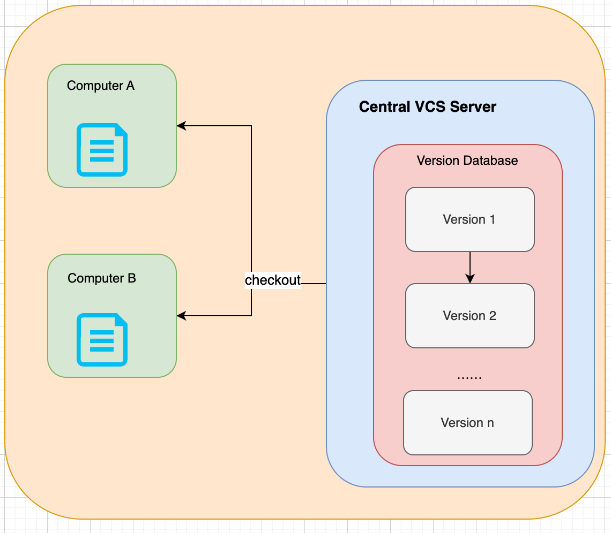
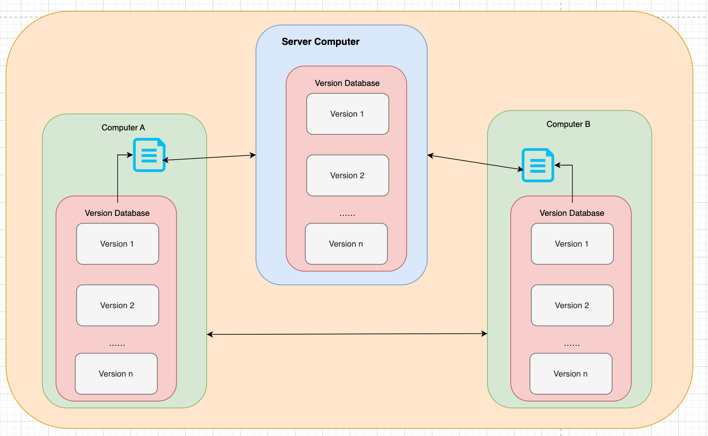

# 为什么需要Git？

上图不难看出：

- 不同版本的文档每次都需要保存为一份独立的文件，非常麻烦，并且不利于管理
- 版本太多，开发者容易陷入版本死胡同

# Git是什么？

简单来说，Git是**目前最流行的分布式版本控制软件**

# 版本控制（管理）

## 概念

在开发过程中用于管理对文件、目录或工程等内容的修改历史，方便查看历史记录、备份，随时都可以恢复到以往版本的软件工程技术。

## 功能

1. 实现跨区域多人协作开发
2. 追踪和记在一个或者多个文件的历史记录
3. 组织和保护源代码和文档
4. 统计工作量
5. 跟踪记录整个项目的开发过程
6. 并行开发，提高开发效率
7. 减轻开发人员的负担，节省时间，同时降低人为错误

## 本地版本控制

### 功能

记录文件的每次更新，可以对每个版本打一个快照或者记录补丁，适合个人使用

### 图示

## 集中版本控制

### 简介

1. 所有的 version data都保存在server上，协同开发者从server上同步更新或者上传自己的修改
2. 用户的local dist只有自己以前所同步的版本，如果不联网的话，用户就看不到历史版本，同时也无法切换版本
3. 所有的数据都保存single server上，如果这个server安全性不高，就会丢失所有的数据，因此需要定期备份
4. 代表产品：SVN、CVS、VSS

### 图示

## 分布式版本控制

### 简介

1. 所有的version、repository全部同步到local的每个用户
2. 可以在local查看所有的版本历史，可以离线在本地提交，只需在联网是push到相应的Server或者其他用户即可
3. 每个用户保存的都是所有的版本数据，只要有一个用户的设备没有问题就可以恢复所有的数据
4. 更加安全，不会因为服务器损坏或者网络问题，造成不能工作的情况
5. 代表产品：Git

### 图示

## Git 🆚 SVN

### SVN

1. SVN是集中式版本控制系统，version database是集中放在中央服务器的，而开发的时候，用的都是local computer，所以需要先从central server得到最新的版本
2. 完成阶段开发后，需要把codes同步到central server，集中式版本控制是必须要联网才能工作

### Git

1. Git是分布式版本控制系统，每个开发者的computer就是一个完整的version database，开发的时候不需要联网，因为版本信息都在local dist

2. 协同开发的方法

   🌰栗子：在自己的电脑修改了文件A，其他开发者也在电脑上修改了文件A。此时，开发者之间只需要把各自的修改推送给对方，就可以互相看到对方的修改了。Git可以直接看到更新了那些代码和文件

=> 作者看来，Git完胜！！！
